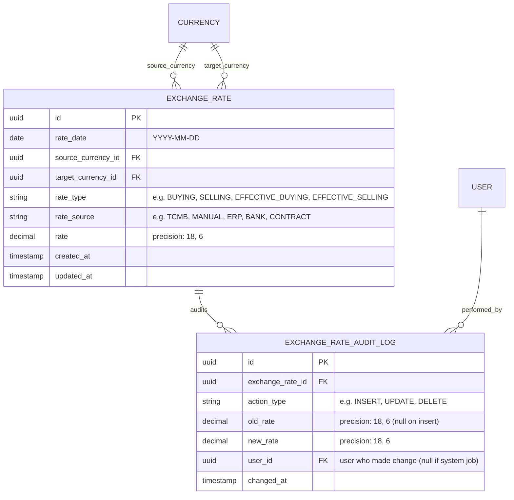
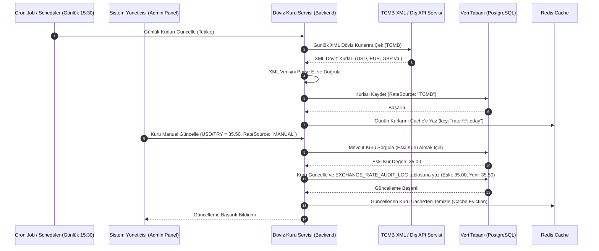

# İş İsteri 10: Döviz Kuru Yönetimi
Bu teknik tasarım, LLM modellerinin günlük döviz kurlarını farklı kaynaklardan (TCMB, ERP, banka vb.) asenkron olarak çekebilecek, manuel güncellemeleri audit log sistemine kaydedebilecek ve kur geçmişini sorgulayabilecek altyapıyı kodlaması için gereken mimariyi tanımlar.

---

## 1. Veri Modeli ve Kur Geçmişi / Denetim Şeması (ERD)

Kurlar ve kur güncellemelerinin takibi için tasarlanan veri tabanı şemasıdır.

### Şema Tasarım Kuralları:
1. **Tekil Kur Kısıtı (Unique Rates Index):** `EXCHANGE_RATE` tablosunda `rate_date`, `source_currency_id`, `target_currency_id`, `rate_type` ve `rate_source` alanlarının birleşimi benzersiz (UNIQUE) olmalıdır. Bu, aynı tarihte aynı kaynaktan aynı tipte mükerrer kur girilmesini engeller.
2. **Hassas Ondalık Değerler:** Döviz kurları için `DECIMAL(18, 6)` veri tipi zorunludur.

---

## 2. Günlük Kur Entegrasyonu ve Manuel Güncelleme Akışı

TCMB'den otomatik kur çekimi ile yöneticilerin elle kur girme/güncelleme akışı aşağıdaki gibidir:

---

## 3. Teknik İş Kuralları (Technical Business Rules)

LLM modelinin bu yapıyı oluştururken uyması gereken kurallar:

1. **Otomatik Entegrasyon Zamanlayıcısı (TCMB Crawler):** Sistemde her gün otomatik olarak çalışan bir asenkron arka plan görevi (Scheduler/Worker) olmalıdır. Bu görev, TCMB'nin kurları açıkladığı saatten hemen sonra (Türkiye saati ile 15:30) `https://www.tcmb.gov.tr/kurlar/today.xml` adresini sorgulamalı ve yeni kurları sisteme kaydetmelidir.
2. **Denetim İzi (Audit Logging):** Manuel olarak yapılan her kur ekleme, güncelleme veya silme işleminde `EXCHANGE_RATE_AUDIT_LOG` tablosuna eski değer, yeni değer, işlemi yapan kullanıcı (`user_id`) ve zaman damgasıyla birlikte zorunlu olarak kayıt atılmalıdır.
3. **Kur Kaynağı Önceliği (Rate Source Fallback):** İşlemlerde döviz kuru sorgulanırken sistem aşağıdaki öncelik sırasına göre kurları aramalıdır:
   * 1. Öncelik: Müşteri Sözleşmesine tanımlanmış olan **Sabit Kur** (Örn: `CONTRACT.fixed_rate`).
   * 2. Öncelik: Manuel girilmiş **Özel Müşteri Kuru** (`RateSource = 'MANUAL'`).
   * 3. Öncelik: ERP sisteminden aktarılan **ERP Kuru** (`RateSource = 'ERP'`).
   * 4. Öncelik: TCMB'den otomatik çekilen **Referans Kur** (`RateSource = 'TCMB'`).
4. **Resmi Tatil ve Hafta Sonu Fallback (Weekend Fallback):** Hafta sonları ve resmi tatillerde TCMB kur yayınlamaz. Kur motoru, kur bulunamayan bir gün için sorgulama yapıldığında, veri tabanındaki en yakın **geçmiş tarihe ait** aktif kuru bulup getirmelidir (Geriye doğru arama limiti maksimum 5 gün olmalıdır).
