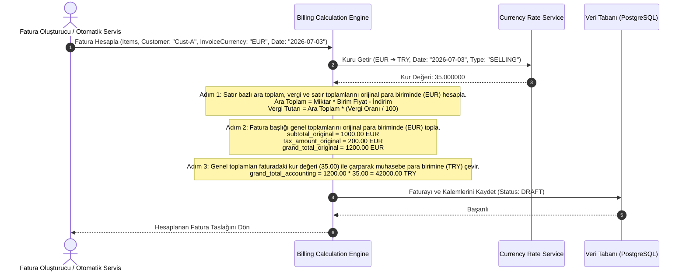

# İş İsteri 11: Çoklu Para Birimi ile Faturalama
Bu teknik tasarım, LLM modellerinin faturalama süreçlerinde farklı işlem dövizi, fatura dövizi ve muhasebe para birimi senaryolarını hatasız şekilde hesaplayıp kaydedebilecek finansal modülü kodlaması için gereken mimariyi tanımlar.

---

## 1. Veri Modeli ve Fatura / Kalem İlişkileri Şeması (ERD)

Fatura başlık ve satır detaylarının çoklu para birimi karşılıklarıyla birlikte saklanmasını sağlayan veritabanı şemasıdır.

```mermaid
erDiagram
    CUSTOMER ||--o{ INVOICE : "billed_to"
    LOCATION ||--o{ INVOICE : "issued_from"
    CURRENCY ||--o{ INVOICE : "invoice_currency"
    CURRENCY ||--o{ INVOICE : "accounting_currency"
    INVOICE ||--o{ INVOICE_ITEM : "contains"
    INVOICE ||--o{ EXCHANGE_DIFFERENCE_LOG : "has_forex_diff"

    INVOICE {
        uuid id PK
        string invoice_number "unique code"
        uuid customer_id FK
        uuid location_id FK
        timestamp issue_date
        uuid invoice_currency_id FK "e.g. EUR"
        uuid accounting_currency_id FK "usually company local base currency, e.g. TRY"
        date exchange_rate_date
        decimal exchange_rate_value "precision: 18, 6"
        decimal subtotal_original "precision: 18, 4"
        decimal tax_amount_original "precision: 18, 4"
        decimal grand_total_original "precision: 18, 4"
        decimal grand_total_accounting "grand_total_original * exchange_rate_value"
        string status "e.g. DRAFT, APPROVED, SENT_TO_ERP, CANCELLED"
        timestamp created_at
    }

    INVOICE_ITEM {
        uuid id PK
        uuid invoice_id FK
        string item_description
        decimal quantity "precision: 18, 4"
        decimal unit_price_original "precision: 18, 4"
        decimal discount_original "precision: 18, 4"
        decimal tax_rate "precision: 5, 2 (e.g. 20.00)"
        decimal tax_amount_original "calculated"
        decimal line_total_original "calculated"
    }

    EXCHANGE_DIFFERENCE_LOG {
        uuid id PK
        uuid invoice_id FK
        timestamp calculation_date
        decimal original_paid_amount "amount paid"
        decimal rate_at_payment "precision: 18, 6"
        decimal exchange_difference_amount "computed in accounting currency"
        string action_taken "e.g. INVOICE_GENERATED, LOGGED_ONLY"
    }
```

### Şema Tasarım Kuralları:
1. **İlişkisel Bütünlük:** Faturadaki tüm tutarlar orijinal para biriminde (`_original` sonekiyle) ve muhasebe para biriminde hesaplanıp ayrı ayrı saklanmalıdır. Bu, ERP entegrasyonunda muhasebe fişi (journal entry) kesilirken yuvarlama farklarının oluşmasını engeller.
2. **Kilitli Kur Bilgisi:** Faturanın kesildiği andaki döviz kuru (`exchange_rate_value`), kur değişikliklerinden etkilenmemesi için faturanın kendi tablosunda kalıcı olarak saklanmalıdır (Döviz kurları tablosuna sadece referans verilmemeli, değer doğrudan faturaya kopyalanmalıdır).

---

## 2. Fatura Hesaplama ve Döviz Çevrim Akışı

Bir fatura oluşturulurken satırların ve toplamların döviz karşılıklarının hesaplanması süreci:

---

## 3. Teknik İş Kuralları (Technical Business Rules)

LLM modelinin bu yapıyı oluştururken uyması gereken kurallar:

1. **Vergi Hesaplama Önceliği (Tax calculation order):** Vergi tutarları kesinlikle **fatura para birimi (orijinal para birimi)** cinsinden hesaplanmalı, küsurat yuvarlamaları orijinal para birimi hassasiyetine göre yapılmalı, ardından çıkan toplam vergi tutarı muhasebe para birimine dönüştürülmelidir. Aksi takdirde, satır satır çevrim yapılıp toplanırsa kuruş farkları (rounding discrepancy) oluşur.
2. **Kur Farkı Hesaplama (Forex Difference Auditor):** Fatura tarihi ile ödeme/tahsilat tarihi arasında kur değişimi olduğunda, sistem muhasebe para birimi cinsinden kur farkını hesaplamalıdır:
   $$\text{Kur Farkı} = \text{Tutar}_{\text{Original}} \times (\text{Kur}_{\text{Ödeme}} - \text{Kur}_{\text{Fatura}})$$
   Çıkan fark artı ise kur farkı gelir faturası, eksi ise kur farkı gider faturası üretilmesi için ERP entegrasyonuna sinyal gönderilmeli veya sistemde otomatik loglanmalıdır (`EXCHANGE_DIFFERENCE_LOG`).
3. **ERP Uyumlu Fiş Yapısı (Accounting Base Split):** ERP sistemine fatura aktarılırken, her bir muhasebe hesabı (cari, satış gelirleri, KDV) için hem dövizli tutar hem de yerel para birimi karşılığı ayrı ayrı gönderilmelidir.
4. **Fatura Kuru Dondurma (Rate Locking):** Fatura `APPROVED` (Onaylandı) durumuna geçtikten sonra, kur tarihi (`exchange_rate_date`) ve kur değeri (`exchange_rate_value`) kesinlikle güncellenemez (read-only) olmalıdır.
