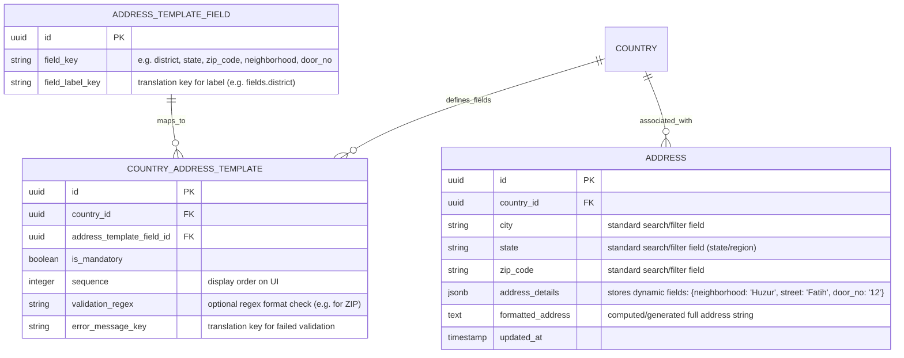
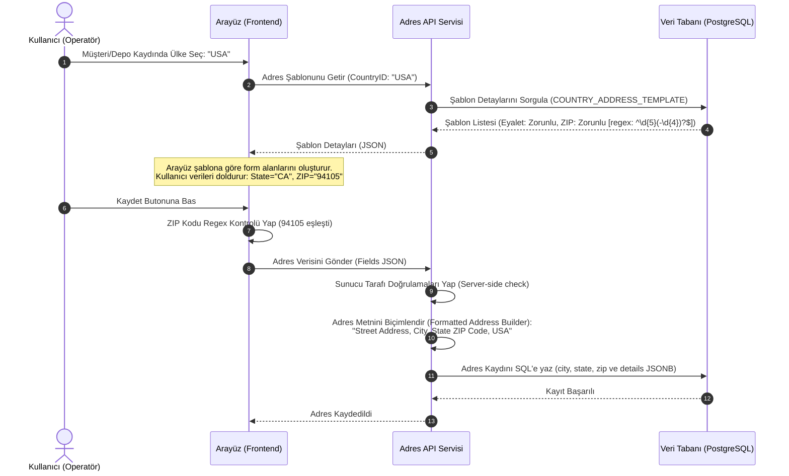

# İş İsteri 12: Yerel ve Uluslararası Adres Formatları
Bu teknik tasarım, LLM modellerinin ülkeye göre değişen dinamik adres alanlarını (Türkiye için Mahalle/İlçe, ABD için Eyalet/ZIP vb.) veritabanı şemasını bozmadan yönetebileceği JSONB tabanlı esnek bir adres mimarisini ve regex doğrulama altyapısını kodlaması için gereken tasarımı tanımlar.

---

## 1. Veri Modeli ve JSONB Tabanlı Adres Şeması (ERD)

Yeni sütun eklemeden her ülkenin adres alanlarını destekleyebilmek için adres bileşenleri **JSONB** tipinde saklanır, kuralları ise şablon tablosu tanımlar.

### Şema Tasarım Kuralları:
1. **JSONB Esnekliği (Dynamic Fields):** İlçe, Mahalle, Sokak, Kapı No, Daire No gibi ülkeye göre değişebilen dinamik alanlar `address_details` içinde JSONB formatında saklanır. Şehir (`city`), Eyalet/Bölge (`state`) ve Posta Kodu (`zip_code`) gibi tüm ülkelerde ortak ve arama/filtreleme için kritik alanlar ise performans için ayrı sütunlarda indeksli (Indexed) olarak tutulur.
2. **Unicode Desteği (Cyrillic, Arabic etc.):** Veritabanı karakter seti kesinlikle **UTF-8 (veya UTF-16)** (PostgreSQL'de varsayılan, SQL Server'da `NVARCHAR`) olarak ayarlanmalıdır, böylece uluslararası karakterlerin bozulması önlenir.

---

## 2. Dinamik Adres Giriş ve Formatlama Akışı (Runtime Flow)

Kullanıcı arayüzünde ülke seçildiğinde adres formunun dinamik çizilmesi, doğrulanması ve kaydedilmesi akışıdır:

---

## 3. Teknik İş Kuralları (Technical Business Rules)

LLM modelinin bu yapıyı oluştururken uyması gereken kurallar:

1. **Dinamik Regex Validasyonu (Regex Engine):** Adres kaydedilirken backend, `COUNTRY_ADDRESS_TEMPLATE` tablosundaki `validation_regex` kurallarını dinamik olarak okuyup gelen JSONB alanlarına uygulamalıdır. Regex doğrulamasından geçmeyen kayıtlar veri tabanına yazılmamalıdır.
2. **Adres Biçimlendirici (Address Formatter Utility):** Her ülke için adresin belgelerde (fatura, çeki listesi, etiket) nasıl yazılacağını tanımlayan bir biçimlendirme kuralı olmalıdır. Sistem, girilen JSONB verisinden otomatik olarak tek satırlık `formatted_address` alanını üretip veritabanına kaydetmelidir (Örn: TR için `Mahalle, Sokak No:X D:Y İlçe/İl`, US için `Street, City, State ZIP`).
3. **UTF-8 Uyumluluğu (Non-Latin Characters):** Unicode karakterlerin (Örn: Çince, Arapça, Rusça karakterler) arayüzde bozulmadan gösterilmesi ve veritabanına kaydedilmesi için API isteklerinde `Content-Type: application/json; charset=utf-8` header kullanımı zorunlu tutulmalıdır.
4. **Adres Arama İndeksleri (Gin Index):** PostgreSQL kullanılacaksa, `address_details` JSONB sütunu üzerinde hızlı arama yapabilmek için **GIN Index** (`CREATE INDEX idx_address_details ON addresses USING gin (address_details);`) tanımlanmalıdır.
