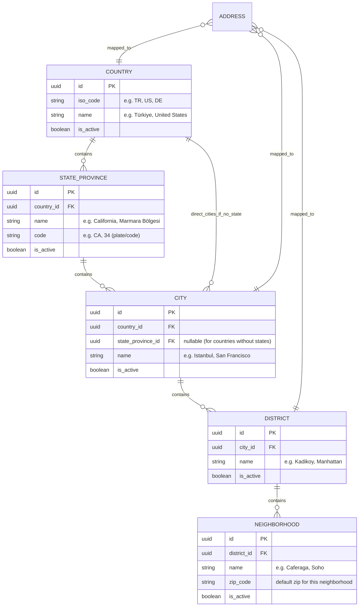
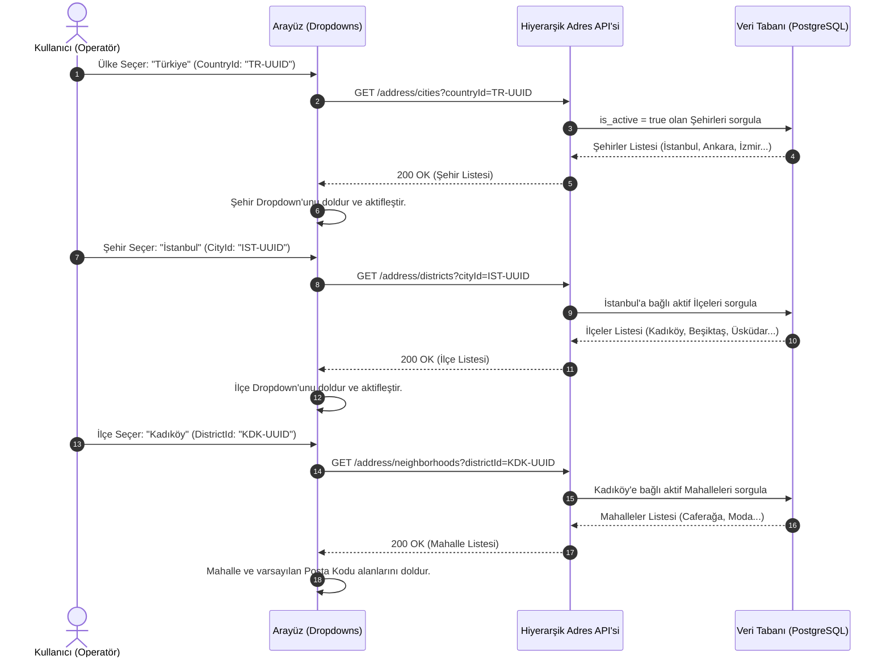

# İş İsteri 13: Hiyerarşik Adres Master Veri Yapısı
Bu teknik tasarım, LLM modellerinin adres verilerinin standart, tutarlı ve raporlanabilir şekilde girilmesini sağlayan hiyerarşik (Ülke ➔ Eyalet/Bölge ➔ Şehir ➔ İlçe ➔ Mahalle) master veri altyapısını ve ilişkili API akışlarını kodlamasını sağlar.

---

## 1. Veri Modeli ve Hiyerarşik Adres Master Tabloları (ERD)

Adres bileşenlerinin birbirine bağlı ilişkisel yapısını ve merkezi olarak nasıl yönetildiğini tanımlayan veri şemasıdır.

### Şema Tasarım Kuralları:
1. **Esnek Hiyerarşi (State/Province Nullable):** Eyalet/Bölge yapısı olmayan ülkeler için `CITY` tablosundaki `state_province_id` boş bırakılabilir ve doğrudan `country_id` ile ilişkilendirilir.
2. **Merkezi Aktiflik Kontrolü (`is_active`):** Adres master verilerindeki herhangi bir birim (Örn: Deprem veya afet nedeniyle kapanan bir mahalle ya da ilçe) pasif yapıldığında, kullanıcılar yeni adres girerken o birimi seçememelidir.

---

## 2. Dinamik Bağımlı Seçim Akışı (Dropdown Cascade Flow)

Kullanıcı arayüzünde adres girilirken hiyerarşik olarak bir önceki seçime bağlı dinamik verilerin yüklenmesi süreci:

---

## 3. Teknik İş Kuralları (Technical Business Rules)

LLM modelinin bu yapıyı oluştururken uyması gereken kurallar:

1. **İlişkili Arama ve Rapor Filtreleme (Denormalized Reporting Filters):** Stok raporlarında veya sevkıyat raporlarında adres bazlı filtreleme yapabilmek için, sorgular alt tablolara (district, city, country) join atılarak çalıştırılmalı ve rapor sorguları bu indeksli alanlar üzerinden filtrelenmelidir.
2. **Veri Giriş Tutarlılığı Kontrolü (Post-Back Validation):** API'ye yeni adres kaydı gönderildiğinde, gönderilen `district_id`'nin gerçekten gönderilen `city_id`'ye bağlı olup olmadığı, `city_id`'nin de seçilen `country_id`'ye ait olduğu sunucu tarafında doğrulanmalıdır (Çapraz manipülasyon engelleme).
3. **Merkezi Master Data Yönetimi (Admin Panel):** Adres verileri (il, ilçe, mahalle listeleri) kullanıcılar tarafından elle serbest metin olarak eklenemez. Sadece sistem yöneticileri (admin) panel üzerinden yeni il/ilçe/mahalle kaydı açabilir veya pasife alabilir.
4. **Posta Kodu Otomatik Doldurma:** Bir mahalle seçildiğinde, `NEIGHBORHOOD` tablosundaki `zip_code` değeri arayüzdeki Posta Kodu alanına otomatik yazılmalı ancak gerektiğinde kullanıcının değiştirebilmesi için alan düzenlenebilir (editable) olmalıdır.
