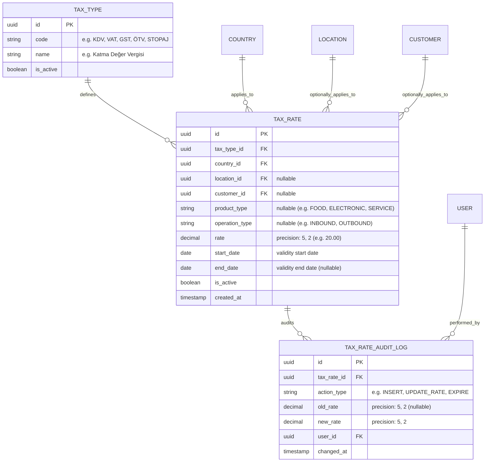
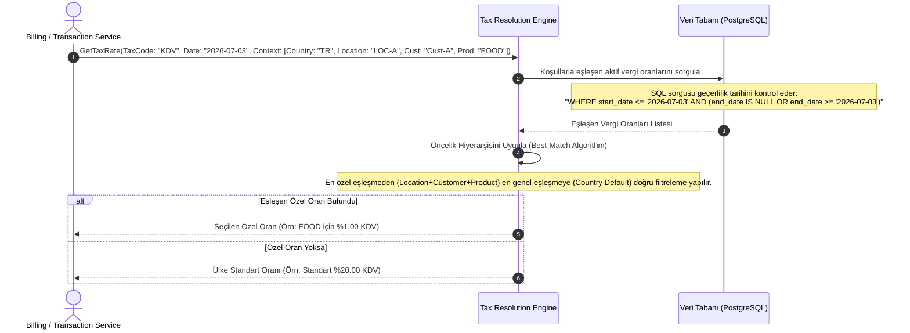

# İş İsteri 14: Farklı Vergi Oranları Yönetimi
Bu teknik tasarım, LLM modellerinin ülkeden ülkeye veya üründen ürüne değişen vergi oranlarını (KDV, VAT, GST, Stopaj, ÖTV vb.) tarih bazlı sürümleyerek yönetebileceği ve işlemlere doğru vergi oranını atayabilecek dinamik vergi çözümleme altyapısını kodlaması için gereken mimariyi tanımlar.

---

## 1. Veri Modeli ve Sürüm Kontrollü Veri Tabanı Şeması (ERD)

Vergi oranlarının tarih bazlı değişebilmesi ve geçmiş işlemlerin bozulmaması için tasarlanan sürümlemeli veri tabanı şemasıdır.

### Şema Tasarım Kuralları:
1. **Zaman Serisi Yapısı (Temporal Data):** Vergi oranları doğrudan güncellenmemeli, tarih aralıklarıyla (`start_date` - `end_date`) versiyonlanmalıdır. Bir vergi oranı değiştiğinde mevcut oran kaydının `end_date` değeri sonlandırılmalı ve yeni oranı içeren yeni bir satır eklenmelidir.
2. **Çok Boyutlu Kurallar:** Vergi oranı; Ülke, Lokasyon, Müşteri, Ürün Tipi ve Operasyon Tipi boyutlarına göre en özel kuralı bulacak şekilde sorgulanabilir olmalıdır.

---

## 2. Dinamik Vergi Oranı Çözümleme Akışı (Tax Resolution Flow)

Bir fatura satırı hesaplanırken sistemin en doğru ve güncel vergi oranını çözme (resolve) süreci:

---

## 3. Teknik İş Kuralları (Technical Business Rules)

LLM modelinin bu yapıyı oluştururken uyması gereken kurallar:

1. **Öncelik Çözümleme Hiyerarşisi (Best Match Rule):** Vergi oranı çözümlenirken çakışmaları çözmek için sistem en spesifik kuraldan genel kurala doğru şu sıralamayı takip etmelidir:
   * 1. Sıra (En Özel): `Location` + `Customer` + `Product Type` eşleşmesi.
   * 2. Sıra: `Location` + `Product Type` eşleşmesi.
   * 3. Sıra: `Customer` + `Product Type` eşleşmesi.
   * 4. Sıra: `Product Type` eşleşmesi.
   * 5. Sıra (En Genel): `Country` standart vergi oranı.
2. **Tarih Geçerlilik Kontrolü (Temporal Validation):** Sistem geçmişe dönük fatura ürettiğinde, faturanın **düzenlendiği tarihteki** geçerli vergi oranı kullanılmalıdır. Kurallar üzerinde `start_date` ve `end_date` alanları ile kesintisiz bir tarih dizisi yönetilmeli, tarih çakışmaları (Örn: Aynı vergi tipi için bir ülkede aynı tarihte iki standart oran bulunması) engellenmelidir.
3. **Değişikliklerin Audit Loglanması:** Bir vergi oranının güncellenmesi veya yeni oran tanımlanması durumunda `TAX_RATE_AUDIT_LOG` tablosuna eski oran, yeni oran, işlemi yapan kullanıcı ve zaman damgası bilgileriyle birlikte kayıt atılması zorunludur.
4. **Vergi Muafiyet İstisnası (Tax Exemption):** Eğer müşterinin veya işlemin vergi muafiyeti durumu varsa, vergi motoru vergi oranını otomatik olarak `%0` çözmeli ve vergi muafiyet kodunu (`tax_exemption_code`) fatura satırına eklemelidir.
