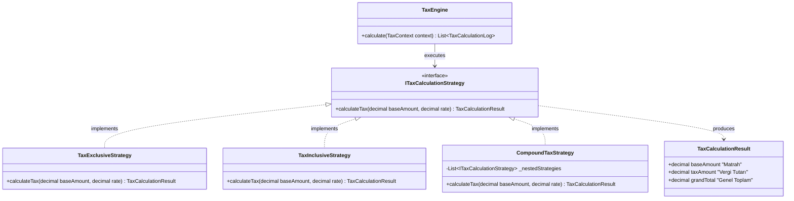
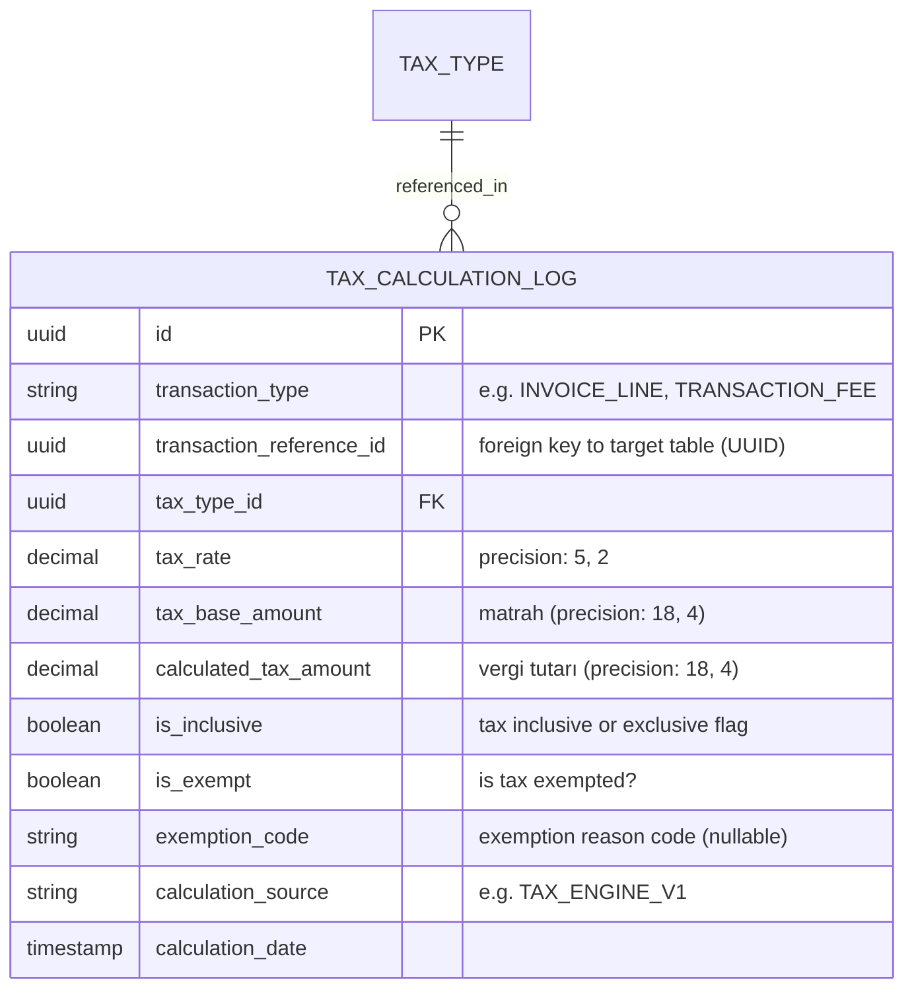
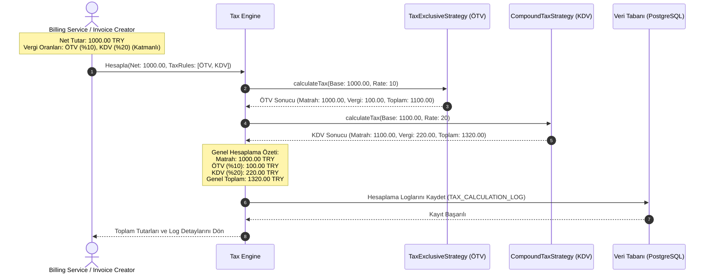

# İş İsteri 15: Vergi Hesaplama Mekanizması
Bu teknik tasarım, LLM modellerinin vergi dahil/hariç hesaplama, çoklu vergi uygulama (Örn: ÖTV + KDV), muafiyetler ve kur farkı vergilerini hesaplayan, izlenebilirliği yüksek bir **Veri Tabanı Entegreli Vergi Hesaplama Motorunu** (Tax Calculation Engine) kodlamasını sağlar.

---

## 1. Yazılım Tasarım Deseni: Strateji Deseni (Strategy Pattern)

Farklı vergi hesaplama kurallarının (Dahil vergi, Hariç vergi, Katmanlı/Çoklu vergi vb.) esnek ve genişletilebilir şekilde yönetilmesi için **Strategy Pattern** kullanılır.

---

## 2. İzlenebilirlik Veri Modeli ve Log Şeması (ERD)

Her vergi hesaplamasının vergi denetimleri için detaylı bir şekilde saklanmasını sağlayan izlenebilirlik şemasıdır.

---

## 3. Katmanlı / Çoklu Vergi Hesaplama Akışı (Sequence Flow)

Bir ürüne hem ÖTV (Özel Tüketim Vergisi) hem de ÖTV'li tutar üzerinden KDV uygulanması (katmanlı vergi) senaryosunun hesaplanma akışıdır:

---

## 4. Teknik İş Kuralları (Technical Business Rules)

LLM modelinin bu yapıyı oluştururken uyması gereken kurallar:

1. **Matematiksel Formül Standartları:**
   * **Vergi Hariç (Tax-Exclusive):**
     $$\text{Vergi Tutarı} = \text{Matrah} \times \frac{\text{Vergi Oranı}}{100}$$
     $$\text{Genel Toplam} = \text{Matrah} + \text{Vergi Tutarı}$$
   * **Vergi Dahil (Tax-Inclusive):**
     $$\text{Matrah} = \frac{\text{Genel Toplam}}{1 + \frac{\text{Vergi Oranı}}{100}}$$
     $$\text{Vergi Tutarı} = \text{Genel Toplam} - \text{Matrah}$$
2. **Hassas Yuvarlama Kuralı:** Hesaplamalar sırasında çıkabilecek kuruş küsuratları için her faturada tutarlı yuvarlama yapılması amacıyla dilin Decimal kütüphaneleri (Örn: C#'ta `decimal`, Python'da `decimal.Decimal`) kullanılmalıdır. Ara hesaplamalarda yuvarlama yapılmamalı, en son vergi tutarı hesaplandığında yuvarlama uygulanmalıdır.
3. **Kur Farkı Vergi Hesaplaması (Forex Tax Calculation):** Kur farkı faturası kesilmesi gerektiğinde, vergi matrahı kur farkı tutarı olarak kabul edilmeli ve vergi bu fark üzerinden hesaplanarak loglanmalıdır.
4. **Vergi Muafiyeti Durumu (Tax Exemption Logging):** Muafiyet durumunda (`is_exempt = true`), vergi tutarı sıfır (`0.00`) olarak kaydedilmeli ve vergi dairesi raporlamalarında kullanılmak üzere yasal muafiyet kodu (`exemption_code`) mutlaka loglanmalıdır.
