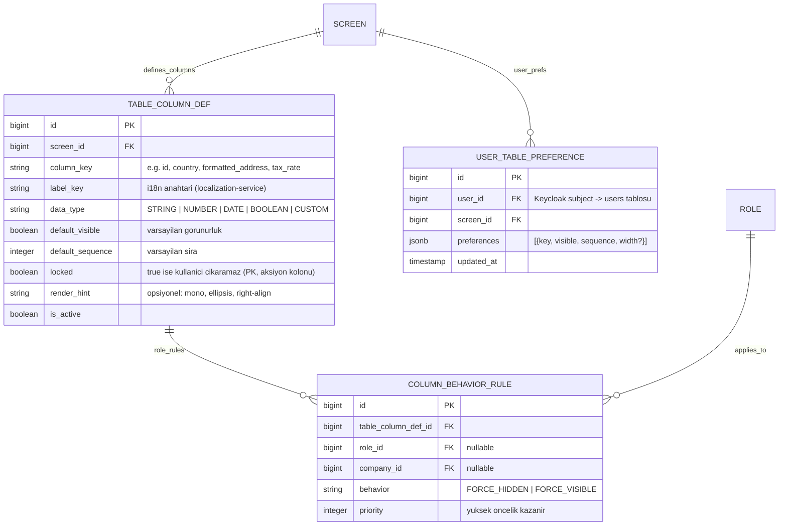

# İş İsteri 16: Konfigüre Edilebilir Tablo Kolonları (Dynamic Column Engine)
Bu teknik tasarım, LLM modellerinin UI'daki tüm liste/tablo ekranlarında kolonların kullanıcı tarafından eklenip çıkarılabilmesini, sıralanabilmesini ve bu tercihlerin kalıcı olarak saklanmasını sağlayan **Dinamik Kolon Motoru**'nu kodlaması için gereken tasarımı tanımlar. Mevcut Dinamik UI Motoru'nun (İş İsteri 5 — `SCREEN`, `SCREEN_FIELD`, `FIELD_BEHAVIOR_RULE`) tablo kolonlarına genişletilmesidir.

---

## 1. Mevcut Durum ve Boşluk Analizi (Gap Analysis)

| Bileşen | Mevcut Durum | Boşluk |
|---|---|---|
| UI tabloları | 16 view'da (`AddressMaster`, `TaxManagement`, `CurrencyExchange`, `billing/*` vb.) elle yazılmış `<table className="wms-table">`, `<th>` başlıkları hard-coded | Ortak `DataTable` bileşeni yok; kolon görünürlüğü hiçbir ekranda yönetilemiyor |
| Dinamik UI Motoru (core-service) | `Screen`, `ScreenField`, `FieldBehaviorRule` + `GET /api/ui/screens/{code}/schema` — **form alanları** için çalışıyor | Tablo kolonu kavramı yok; kullanıcı bazlı tercih saklama yok |
| Tercih kalıcılığı | Yok | Kullanıcı tercihi ne backend'de ne localStorage'da tutuluyor |

**Karar:** Paralel bir altyapı kurmak yerine mevcut Dinamik UI Motoru (wms-core-service, `/api/ui/*`) kolon konfigürasyonu ile genişletilir. Ekran kimliği olarak mevcut `SCREEN.code` kullanılır (örn. `ADDRESS_LIST`, `TAX_RATE_LIST`). Şema çözümlemesi İş İsteri 5 `UiContext` ile uyumlu `roleId` / `companyId` context'i alır.

---

## 2. Veri Modeli (ERD)



### Şema Tasarım Kuralları:
1. **Tek satır JSONB tercih:** Kullanıcı tercihi kolon başına satır yerine `(user_id, screen_id)` başına tek JSONB satırı olarak tutulur (`UNIQUE(user_id, screen_id)`); kaydetme tek upsert'tür. Şirket bazlı tercih yoktur (bilinçli).
2. **Kolon anahtarı tekilliği:** `UNIQUE(screen_id, column_key)` (`uk_tcd_screen_column`).
3. **`locked` kolonlar:** ID ve aksiyon (düzenle/sil butonu) kolonları `locked=true` ile işaretlenir; kullanıcı tercihi bu kolonları gizleyemez (kural yoksa her zaman görünür).
4. **Öncelik zinciri:** `FORCE_HIDDEN` > `locked` / `FORCE_VISIBLE` > kullanıcı tercihi.
   - `FORCE_HIDDEN`: kullanıcı tercihini ezer; kolon column-picker'da görünmez; **locked kolonları da gizleyebilir** (güvenlik).
   - `FORCE_VISIBLE`: kolonu zorla gösterir; çözümlemede `locked=true` sayılır; kullanıcı gizleyemez; picker'da kilitli görünür.
5. **`width` (v1):** JSONB içinde opsiyonel saklanabilir; v1'de ColumnPicker resize yoktur ve `table-schema` yanıtına `width` eklenmez (ileri sürüm).
6. **Kolon tanımları seed ile gelir:** Liste ekranı için önce `SCREEN` satırı gerekir. Her ekranın kolon tanımları Flyway migration'ı ile seed edilir; `label_key` değerleri localization-service çeviri anahtarlarıdır (örn. `columns.address.formattedAddress`) ve aynı migration setinde gelir.

---

## 3. API Tasarımı (wms-core-service, `/api/ui`)

| Method | Endpoint | Açıklama | Rol |
|---|---|---|---|
| GET | `/api/ui/screens/{code}/table-schema?roleId=&companyId=` | Çözümlenmiş kolon listesi: def + rol/şirket kuralı + kullanıcı tercihi | Tüm kullanıcılar |
| PUT | `/api/ui/screens/{code}/table-preferences` | Kullanıcının kolon tercihini upsert eder (`width` opsiyonel; sunucu saklar, v1 çözümlemede dönmez) | Tüm kullanıcılar |
| DELETE | `/api/ui/screens/{code}/table-preferences` | Tercihi siler → varsayılana döner | Tüm kullanıcılar |
| POST/PUT/DELETE | `/api/ui/screens/{code}/columns` | Kolon tanımı CRUD (admin) | `UI_CONFIG_ADMIN` veya `WMS_ADMIN` |
| POST/DELETE | `/api/ui/column-rules` | Rol bazlı kolon kuralı CRUD (admin) | `UI_CONFIG_ADMIN` veya `WMS_ADMIN` |

**Çözümleme sırası (resolution order):** `TABLE_COLUMN_DEF` varsayılanları → `COLUMN_BEHAVIOR_RULE` (rol/şirket, priority; nullable alan = herkes) → `USER_TABLE_PREFERENCE` (yalnızca force edilmemiş kolonlar için) → `locked` / `FORCE_VISIBLE` görünürlük kilidi.

Kolon/kural yönetimi **API + Flyway seed** ile yapılır; bu isterde ayrı bir admin view zorunlu teslimat değildir.

`table-schema` yanıt örneği:

```json
{
  "screenCode": "ADDRESS_LIST",
  "columns": [
    {
      "key": "id",
      "labelKey": "columns.common.id",
      "dataType": "STRING",
      "visible": true,
      "sequence": 0,
      "locked": true,
      "renderHint": null,
      "forceHidden": false,
      "forceVisible": false
    },
    {
      "key": "country",
      "labelKey": "columns.address.country",
      "dataType": "STRING",
      "visible": true,
      "sequence": 1,
      "locked": false,
      "renderHint": null,
      "forceHidden": false,
      "forceVisible": false
    },
    {
      "key": "state",
      "labelKey": "columns.address.state",
      "dataType": "STRING",
      "visible": false,
      "sequence": 2,
      "locked": false,
      "renderHint": "ellipsis",
      "forceHidden": false,
      "forceVisible": false
    }
  ]
}
```

---

## 4. Çalışma Zamanı Akışı (Runtime Flow)

```mermaid
sequenceDiagram
    autonumber
    actor User as Kullanıcı
    participant UI as Arayüz (DataTable bileşeni)
    participant API as Core UI API (/api/ui)
    participant DB as PostgreSQL

    User->>UI: Liste ekranını açar (örn. ADDRESS_LIST)
    UI->>API: GET /screens/ADDRESS_LIST/table-schema?roleId=&companyId=
    API->>DB: def + rol/şirket kuralları + kullanıcı tercihi oku
    API-->>UI: Çözümlenmiş kolon listesi
    Note over UI: FORCE_HIDDEN kolonlar picker'da yok; FORCE_VISIBLE/locked gizlenemez
    UI-->>User: Tablo, görünür kolonlarla çizilir

    User->>UI: Kolon seçiciyi açar, "Eyalet" kolonunu ekler, sırayı değiştirir
    UI->>API: PUT /screens/ADDRESS_LIST/table-preferences {columns:[...]}
    API->>DB: UPSERT user_table_preference
    API-->>UI: 200 OK
    UI-->>User: Tablo yeni kolon setiyle anında yeniden çizilir
```

---

## 5. Frontend Tasarımı (wms-ui)

1. **Generic `DataTable.tsx` bileşeni:** `props = { screenCode, renderers: Record<key, CellRenderer>, rows, rowKey, fallbackColumns, roleId?, companyId? }`. Bileşen şemayı `GET table-schema` ile çeker (context query), görünür kolonları sıralı çizer, sağ üstte **kolon seçici** (checkbox listesi + sürükle-bırak sıralama + "Varsayılana dön") sunar. v1'de kolon resize yoktur.
2. **Cell renderer sözleşmesi:** View, her `column_key` için render fonksiyonunu verir; backend yalnızca *hangi* kolonların görüneceğini söyler, *nasıl* çizileceğini UI bilir. `dataType` / `renderHint` isteğe bağlı stil ipucudur. Backend'de tanımlı ama UI'da renderer'ı olmayan kolon atlanır (ileri/geri uyumluluk).
3. **Fallback:** `table-schema` çağrısı başarısız olursa bileşen view'ın verdiği `fallbackColumns` setini varsayılan görünürlükle çizer (ekran asla boş kalmaz). Son başarılı şema localStorage'a cache'lenir.
4. **Kademeli geçiş:** 16 view tek seferde değil fazlarla `DataTable`'a taşınır.
   - **Faz 1 (pilot kabul):** `AddressMaster`, `TaxManagement`, `CurrencyExchange` — `DataTable` kullanımı, tercihler cihazlar arası kalıcı, `FORCE_HIDDEN` ile picker'dan gizleme doğrulanır.
   - **Faz 2:** kalan liste view'ları. Eski `wms-table` kullanımı geçiş süresince çalışmaya devam eder.

---

## 6. Teknik İş Kuralları (Technical Business Rules)

1. **Tercih taşınabilirliği:** Tercihler backend'de `(user_id, screen_id)` ile saklanır; cihaz/tarayıcı değişiminde korunur. localStorage yalnızca cache'tir, kaynak değildir. Şirket bazlı tercih yoktur.
2. **Bilinmeyen kolon temizliği:** Şema çözümlenirken kullanıcı tercihinde olup artık `TABLE_COLUMN_DEF`'te olmayan (silinmiş/pasif) kolon anahtarları sessizce elenir.
3. **i18n zorunluluğu:** Kolon başlıkları asla hard-coded metin olamaz; `label_key` üzerinden mevcut çeviri altyapısıyla (İş İsteri 2) çözülür. Yeni kolon seed'i, çeviri anahtarlarının seed'i ile aynı migration setinde gelir.
4. **Performans:** `table-schema` yanıtı kullanıcı+ekran bazında cache'lenebilir (ETag/short TTL); tercih PUT'u cache'i invalide eder.
5. **Denetim (Audit):** Admin'in kolon tanımı ve rol kuralı değişiklikleri audit-log'a yazılır; kullanıcı tercihi değişiklikleri audit kapsamı dışıdır (kişisel ayar).
6. **Yetki:** Kolon tanımı/kural CRUD `hasAnyRole('UI_CONFIG_ADMIN', 'WMS_ADMIN')`. Keycloak'ta `UI_CONFIG_ADMIN` realm rolü seed edilir. Tercih endpoint'leri kimliği doğrulanmış her kullanıcıya açıktır ve yalnızca kendi tercihine erişebilir (JWT subject'ten user çözülür, path'ten user_id alınmaz).
7. **Davranış önceliği:** `FORCE_HIDDEN` > `FORCE_VISIBLE` / `locked` > kullanıcı tercihi. `FORCE_HIDDEN` locked kolonları gizleyebilir. `FORCE_VISIBLE` çözümlemede locked sayılır ve tercihi ezer.
8. **`width` (v1):** Tercih JSONB'sinde opsiyonel tutulabilir; UI resize yok; `table-schema` `width` dönmez.
9. **Context eşleştirme:** `COLUMN_BEHAVIOR_RULE` içinde `role_id` / `company_id` null ise kural herkes için geçerlidir. Çoklu rolde istemci aktif `roleId`'yi query ile gönderir.
10. **Eşzamanlılık:** Tercih upsert **last-write-wins**; optimistic lock yoktur.
11. **Kapsam dışı (v1):** Server-side sort / filter / export'un kolon tercihine bağlanması bu isterin parçası değildir.
12. **Pilot kabul:** Faz 1 üç pilot view'da `DataTable` + kalıcı tercihler + `FORCE_HIDDEN` testi geçmeden Faz 2'ye geçilmez.
