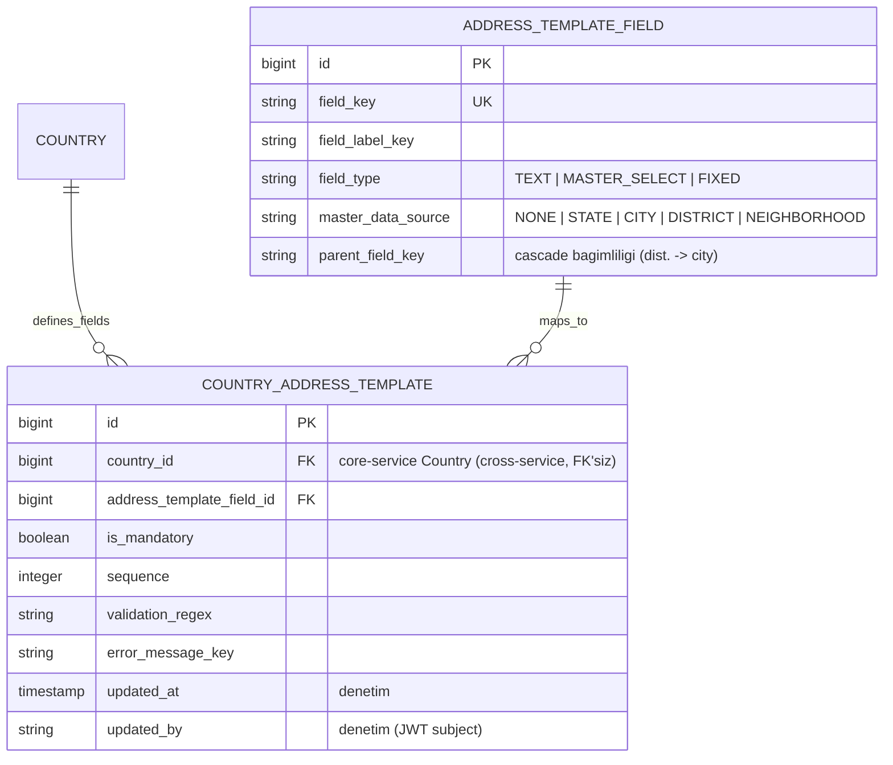

# İş İsteri 17: Ülke Bazlı Adres Yapısı Konfigürasyon Ekranı (Address Template Admin)
Bu teknik tasarım, LLM modellerinin ülke bazlı adres şablonlarının (İş İsteri 12'de tanımlanan `COUNTRY_ADDRESS_TEMPLATE` / `ADDRESS_TEMPLATE_FIELD`) **UI üzerinden** yönetilebilmesini — örneğin bugün eyalet yapısı olmayan Türkiye'ye eyalet alanının konfigürasyonla eklenebilmesini — kodlaması için gereken tasarımı tanımlar.

---

## 1. Mevcut Durum ve Boşluk Analizi (Gap Analysis)

| Bileşen | Mevcut Durum | Boşluk |
|---|---|---|
| Veri modeli (localization-service) | `CountryAddressTemplate` ve `AddressTemplateField` (TEXT / MASTER_SELECT / FIXED, master_data_source, parent_field_key) şablon/alan modeli **yeterli**; denetim için `updated_at` / `updated_by` eklenir | Başka tablo/kolon gerekmez |
| Şablon değişikliği | Yalnızca Flyway seed migration'ları ile (V12_2, V16, V17, V19, V20, V21) — her değişiklik deploy gerektirir | Runtime'da CRUD yok |
| API | Sadece `GET /api/addresses/templates/{countryId}` (read-only) | Şablon ve alan kataloğu için yazma endpoint'leri yok |
| UI | `AddressMaster.tsx` şablonu `DynamicAddressField` ile dinamik render ediyor | Yönetim (admin) ekranı yok |

**Karar:** localization-service'e admin CRUD API'si ve wms-ui'a `AddressTemplateConfig` ekranı eklenir. `AddressMaster`'da alan başına hard-coded UI eklenmez — şablon + `DynamicAddressField` ile render edilir; boş MASTER_SELECT master verisi için genel serbest-metin fallback bu isterin tüketici kuralıdır (yeni `field_key` hardcode'u değil).

---

## 2. Veri Modeli

ERD İş İsteri 12 ile aynıdır; denetim için `updated_at` / `updated_by` kolonları eklenir. Ülke başına alan tekilliği `uq_cat_country_field UNIQUE (country_id, address_template_field_id)` ile garanti edilir.



**`field_type` semantiği:**

| Tip | Anlam | Örnek |
|---|---|---|
| `TEXT` | Serbest metin; `DynamicAddressField` çizer | `street`, `door_no` |
| `MASTER_SELECT` | Core master data cascade dropdown; boşsa serbest metin fallback | `state` (STATE), `city` (CITY), `district`, `neighborhood` |
| `FIXED` | Yalnızca mandatory/regex kuralı taşır; `DynamicAddressField` çizmez (ayrı sabit input / kolon) | başlıca `zip_code` |

---

## 3. API Tasarımı (wms-localization-service, `/api/addresses`)

### Alan kataloğu (ülkeden bağımsız):

| Method | Endpoint | Açıklama |
|---|---|---|
| GET | `/template-fields` | Tüm alan kataloğu (state, city, district, neighborhood, door_no…) |
| POST | `/template-fields` | Yeni alan tanımı (field_key, label_key, field_type, master_data_source, parent_field_key) |
| PUT | `/template-fields/{id}` | Alan tanımı güncelleme (field_key değiştirilemez — JSONB anahtarıdır) |
| DELETE | `/template-fields/{id}` | Yalnızca hiçbir ülke şablonunda kullanılmıyorsa silinir |

### Ülke şablonu:

| Method | Endpoint | Açıklama |
|---|---|---|
| GET | `/templates/{countryId}` | (Mevcut) Ülkenin şablonu |
| POST | `/templates/{countryId}/fields` | Şablona alan ekler `{fieldId, mandatory, sequence, regex?, errorKey?}` — aynı alan ikinci kez → **409**; MASTER_SELECT ve master veri boşsa `201` + `warning: MASTER_DATA_EMPTY` |
| PUT | `/templates/{countryId}/fields/{templateId}` | mandatory / regex / errorKey günceller |
| PUT | `/templates/{countryId}/reorder` | Toplu sıra güncelleme `[{templateId, sequence}]` |
| DELETE | `/templates/{countryId}/fields/{templateId}` | Alanı şablondan çıkarır |
| POST | `/templates/{countryId}/copy-from/{sourceCountryId}` | Hedef şablonu **replace** eder: hedef satırlar silinir, kaynak satır satır kopyalanır (İş İsteri 18 onboarding). Hedef=kaynak → 400; kaynak boş → 400. Merge yok |

MASTER_SELECT eklenirken localization-service, core-service'e `GET /api/address/states|cities|districts|neighborhoods` ile ön kontrol yapar (`HttpCoreMasterDataClient`, servis-to-servis).

Tüm yazma endpoint'leri `hasAnyRole('ADDRESS_CONFIG_ADMIN', 'LOCALIZATION_ADMIN', 'WMS_ADMIN')` gerektirir.

---

## 4. Konfigürasyon Akışı — "Türkiye'ye Eyalet Ekleme" Senaryosu

```mermaid
sequenceDiagram
    autonumber
    actor Admin as Yönetici
    participant UI as AddressTemplateConfig (Frontend)
    participant LOC as Localization API
    participant CORE as Core API (master data)
    participant DB as PostgreSQL

    Admin->>UI: Ülke = Türkiye seçer
    UI->>LOC: GET /templates/{trId}
    LOC-->>UI: Mevcut şablon (city, district, neighborhood, zip_code…)
    Admin->>UI: Katalogdan "state" alanını ekler (mandatory=false)
    UI->>LOC: POST /templates/{trId}/fields {fieldId: state}
    LOC->>CORE: GET /api/address/states?countryId=trId (master data ön kontrolü)
    CORE-->>LOC: [] (TR'de eyalet master verisi yok)
    LOC-->>UI: 201 Created + warning: "MASTER_DATA_EMPTY"
    UI-->>Admin: "Alan eklendi. Uyarı: TR için eyalet master verisi boş — İş İsteri 18 ekranından ekleyin."
    Note over LOC,DB: Şablon cache'i evict edilir

    actor Op as Operatör
    Op->>UI: AddressMaster'da TR seçer
    UI->>LOC: GET /templates/{trId}
    LOC-->>UI: Şablon artık "state" içeriyor
    UI-->>Op: Form MASTER_SELECT ile çizilir; master boşsa serbest metin fallback (yeni hard-coded alan YOK)
```

**Kritik nokta:** Katalogdaki `state` alanı `MASTER_SELECT` + `master_data_source=STATE` tipindedir; dropdown verisi core-service `state_provinces` tablosundan gelir. TR'ye eyalet **alanını** eklemek şablon işidir (bu ister), eyalet **verisini** eklemek master data işidir (İş İsteri 18). Sistem ikisini ayırır ama admin'i uyarıyla yönlendirir.

---

## 5. Frontend Tasarımı (wms-ui — yeni view `AddressTemplateConfig.tsx`)

1. **Sol panel — şablon düzenleyici:** Ülke seçici → mevcut şablon alanları sıralı liste (sürükle-bırak `sequence`), her satırda mandatory toggle, regex ve errorKey inputları, çıkar butonu.
2. **Alan ekleme:** "Alan Ekle" → katalog dropdown'u (**şablonda zaten olanlar elenir** — unique) veya "Yeni Alan Tanımla" modal'ı (field_key, label çeviri anahtarı, tip, master data kaynağı, parent). Yeni alanda `field_label_key` / `error_message_key` için çeviri anahtarlarının localization çeviri API'si veya seed ile oluşturulması gerekir; eksik anahtar UI'da key fallback gösterir (İş İsteri 2). "Alan Ekle" anında `POST` ile persist edilir (draft şablon yok).
3. **Sağ panel — canlı önizleme:** Sunucudaki güncel şablon + panelde henüz PUT edilmemiş mandatory/regex taslakları, `AddressMaster` ile aynı `DynamicAddressField` bileşenleriyle çizilir. "Kaydetmeden gör" yalnızca satır içi düzenlemeler içindir; katalogdan ekleme hemen kaydedilir.
4. **Regex test kutusu:** Regex girilen alanda örnek değerle anlık test ("35000" → ✓).
5. Liste ekranları İş İsteri 16'daki `DataTable` bileşenini kullanır.

---

## 6. Teknik İş Kuralları (Technical Business Rules)

1. **`field_key` değişmezliği:** Kayıtlı adreslerin JSONB anahtarı olduğu için mevcut bir alanın `field_key`'i güncellenemez; yanlışsa yeni alan açılıp eskisi şablonlardan çıkarılır.
2. **Regex derleme kontrolü:** `validation_regex` kaydedilmeden önce backend'de derlenir (`Pattern.compile`); derlenemeyen regex 400 döner. UI tarafı da aynı kontrolü yapar (mevcut `AddressMaster` geçersiz regex'i zaten sessizce atlıyor — savunma iki katmanlı olur).
3. **Cascade bütünlüğü:** `parent_field_key` verilen alan şablona eklenirken parent alanın da aynı ülke şablonunda olması zorunludur (district → city varsa city şablonda olmalı); döngüsel bağımlılık reddedilir. Alan çıkarılırken ona parent'lık eden çocuk alan varsa işlem engellenir.
4. **MASTER_SELECT ön kontrolü ve tüketici fallback:** Master data kaynaklı alan eklenirken hedef ülkede ilgili master veri boşsa işlem engellenmez ama `MASTER_DATA_EMPTY` uyarısı döner (bkz. Bölüm 4). `AddressMaster` / `DynamicAddressField`, boş master verili MASTER_SELECT alanını operatöre serbest metin olarak sunar (genel kural; alan-özel hardcode değil).
5. **Geriye dönük veri uyumluluğu:** Şablon değişikliği kayıtlı adresleri **bozmaz**. Alan çıkarıldığında eski adreslerin JSONB'sindeki değer durur, render'da yoksayılır. Alan sonradan mandatory yapıldığında kural yalnızca yeni kayıt/güncellemelere uygulanır; mevcut kayıtlar toplu geçersiz sayılmaz.
6. **İndeksli kolonlar ve FIXED:** `state`, `city`, `zip_code` Address üzerinde indeksli ayrı kolonlarda tutulduğundan (İş İsteri 12) şablondan tamamen çıkarılmaları yerine `mandatory=false` yapılması önerilir. Katalogda `state` / `city` = `MASTER_SELECT` (STATE/CITY); `FIXED` başlıca `zip_code` içindir (kural taşır, `DynamicAddressField` çizmez).
7. **Cache invalidation:** Şablon her yazma işleminde `templates/{countryId}` cache'i evict edilir; UI, ülke seçiminde şablonu her zaman taze çeker (mevcut davranış korunur).
8. **Sıra tekilliği:** Aynı ülke şablonunda `sequence` çakışması reorder endpoint'inde transactional olarak çözülür (unique constraint `country_id + sequence` deferred).
9. **Denetim:** Tüm şablon değişiklikleri audit-log'a `updated_by` (JWT subject) ile yazılır; satırda `updated_at` güncellenir.
10. **`copy-from` = replace:** Hedef ülkenin mevcut şablon satırları silinir, kaynak şablon kopyalanır. Merge yok. Hedef=kaynak veya kaynak boş → 400.
11. **Ülke + alan tekilliği:** `uq_cat_country_field`; aynı `address_template_field` ikinci kez eklenirse **409**.
12. **Yetki:** Yazma endpoint'leri `hasAnyRole('ADDRESS_CONFIG_ADMIN', 'LOCALIZATION_ADMIN', 'WMS_ADMIN')`. Keycloak'ta `ADDRESS_CONFIG_ADMIN` realm rolü seed edilir.
13. **i18n:** Yeni katalog alanı veya şablon `error_message_key` için çeviri anahtarları localization çeviri altyapısı (İş İsteri 2) ile oluşturulur; eksik anahtar UI'da key string fallback gösterir.
14. **Eşzamanlılık (v1):** Optimistic lock yok; **last-write-wins**. `updated_at` / `updated_by` yalnızca denetim içindir.
15. **Cross-service auth:** MASTER_SELECT ön kontrolü localization → core `HttpCoreMasterDataClient` (servis-to-servis HTTP) ile yapılır; operatör JWT'si path'ten user seçmez, yazma işlemlerinde subject `updated_by` için kullanılır.
