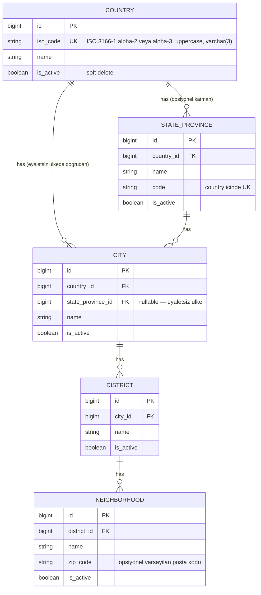
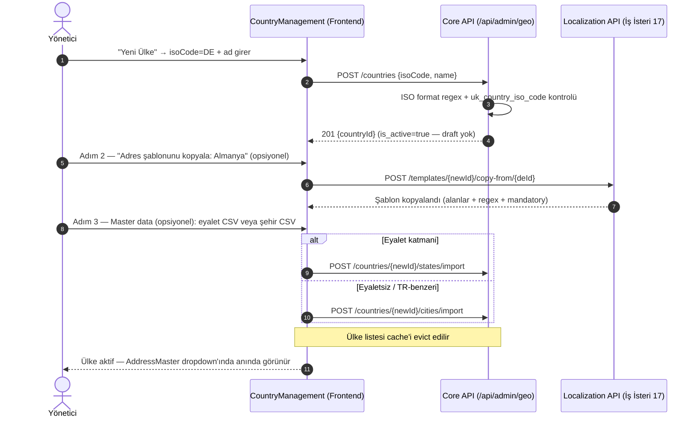

# İş İsteri 18: UI Üzerinden Ülke ve İdari Birim Yönetimi (Country Master Data Admin)
Bu teknik tasarım, LLM modellerinin yeni ülkelerin ve ülkeye bağlı idari birimlerin (eyalet, şehir, ilçe, mahalle) **UI üzerinden** eklenip yönetilebilmesini ve yeni ülkenin adres konfigürasyonunun (İş İsteri 17) yapılabilir hale gelmesini kodlaması için gereken tasarımı tanımlar.

---

## 1. Mevcut Durum ve Boşluk Analizi (Gap Analysis)

| Bileşen | Mevcut Durum | Boşluk |
|---|---|---|
| Veri modeli (wms-core-service) | `Country` (iso_code UK, name, soft-delete `is_active`), `StateProvince` (country_id + code UK), `City`, `District`, `Neighborhood` hiyerarşisi **mevcut** (İş İsteri 13). `Region` depo/lokasyon coğrafyasıdır; adres master’ın parçası değildir | Şema değişikliği gerekmez |
| Veri girişi | Yalnızca Flyway seed | Runtime CRUD yok |
| API | `AddressController` read-only: `GET /api/address/countries, /states, /cities, /districts, /neighborhoods` | Yazma endpoint'leri yok |
| UI | `AddressMaster` ülke dropdown'ı core'dan besleniyor | Ülke/idari birim yönetim ekranı yok |
| Cross-service | localization-service `country_id`'yi FK'siz referans alıyor (`CountryAddressTemplate.countryId`, `Address.countryId`) | Silme/pasifleştirmede usage özeti / tutarlılık kontrolü yok |

**Karar:** wms-core-service'e `/api/admin/geo/*` admin CRUD API'si ve wms-ui'a `CountryManagement` ekranı eklenir. Ülke oluşturma sihirbazı, İş İsteri 17'nin `copy-from` endpoint'ini çağırarak adres şablonu kurulumunu aynı akışa bağlar.

---

## 2. Veri Modeli

ERD İş İsteri 13 ile aynıdır (Country → StateProvince → City → District → Neighborhood). Şema değişikliği yoktur; yalnızca kurallar netleştirilir. `Region` bu isterin kapsamı dışındadır (Location ilişkisi).

**Eyalet katmanı opsiyoneldir:** `City.state_province_id` nullable'dır — eyaletsiz ülkede şehir doğrudan ülkeye bağlanır. Bir ülkeye sonradan eyalet sistemi eklendiğinde (TR senaryosu) mevcut şehirler **otomatik taşınmaz**; admin `assign-state` ile kademeli taşır. Taşınana kadar eyaletli ve eyaletsiz bağlanma modelleri birlikte yaşar.

---

## 3. API Tasarımı (wms-core-service, `/api/admin/geo`)

| Method | Endpoint | Açıklama |
|---|---|---|
| GET | `/countries` | Pasifler dahil admin listesi (`stateCount`, `cityCount`, best-effort `templateExists`) |
| POST | `/countries` | Yeni ülke `{isoCode, name}` — ISO format + tekillik kontrolü; kayıt anında `is_active=true` |
| PUT | `/countries/{id}` | Ad güncelleme (iso_code değiştirilemez) |
| DELETE | `/countries/{id}` | Pasifleştirme (soft delete) — API engellemez; UI önce usage onayı gösterir |
| POST | `/countries/{id}/reactivate` | Soft-delete geri alma |
| GET | `/countries/{id}/usage` | Cross-service özet: `addressCount`, `templateExists`, `reachable` — pasifleştirme onay diyaloğu kaynağı |
| POST | `/countries/{id}/states` | Eyalet ekleme `{name, code}` |
| PUT/DELETE | `/states/{id}` | Eyalet güncelleme / pasifleştirme (aktif şehir varken DELETE → 409) |
| POST | `/countries/{id}/states/import` | CSV toplu eyalet yükleme (`name[,code]`) — **eyalet katmanı olan ülkeler** için |
| POST | `/countries/{id}/cities` | Şehir ekleme; body'de opsiyonel `stateProvinceId` (eyaletli/eyaletsiz) |
| PUT | `/cities/{id}` | Şehir adı / üst birim güncelleme |
| DELETE | `/cities/{id}` | Şehir pasifleştirme (aktif ilçe varken → 409) |
| PUT | `/cities/{id}/assign-state` | Mevcut şehri eyalete bağlama (TR geçiş senaryosu) |
| POST | `/countries/{id}/cities/import` | CSV toplu şehir yükleme (`name` veya `name,stateCode`) — eyaletsiz / TR-benzeri hacimli giriş (örn. 81 il) |
| POST | `/cities/{id}/districts` | İlçe ekleme |
| PUT/DELETE | `/districts/{id}` | İlçe güncelleme / pasifleştirme (aktif mahalle varken DELETE → 409) |
| POST | `/districts/{id}/neighborhoods` | Mahalle ekleme |
| PUT/DELETE | `/neighborhoods/{id}` | Mahalle güncelleme / pasifleştirme |

Tüm yazma (ve admin okuma) endpoint'leri `hasAnyRole('GEO_ADMIN', 'WMS_ADMIN')` gerektirir. Mevcut read-only `/api/address/*` endpoint'leri değişmez; pasif ülke id→ad çözümü için `GET /api/address/countries?includeInactive=true` varyantı eklenir (Bölüm 6).

---

## 4. Yeni Ülke Kurulum Akışı (Country Onboarding Wizard)

Sihirbaz adımları atlanabilir: şablonsuz ülke `AddressMaster`'da "ek alan yok" olarak açılır (mevcut `templateLoaded && template.length === 0` davranışı bunu zaten destekler). Ülke oluşturma anında aktiftir; kurulum tamamlanana kadar gizleme (draft) yoktur.

---

## 5. Frontend Tasarımı (wms-ui — yeni view `CountryManagement.tsx`)

1. **Ülke listesi:** İş İsteri 16 `DataTable` bileşeni ile (kolonlar: iso, ad, eyalet sayısı, şehir sayısı, şablon var/yok, aktif). `templateExists` admin liste DTO'sunda LocalizationUsageClient ile **best-effort** zenginleştirilir; onay diyaloğu için satır bazlı `GET /countries/{id}/usage` kullanılır. Satır aksiyonları: düzenle, pasifleştir (**önce usage onayı**), yeniden aktifleştir, "Adres şablonu" (İş İsteri 17 ekranına deep-link).
2. **Kurulum sihirbazı:** 3 adım — kimlik → şablon kopyalama (opsiyonel) → master data (opsiyonel; **states/import** ve **cities/import** destekli).
3. **İdari birim ağacı:** Seçili ülke için Country → State → City → District → Neighborhood ağaç görünümü; her seviyede ekle/düzenle/pasifleştir; şehri eyalete taşıma (drag veya "eyalete ata" / `assign-state`).
4. Ülke adı gösterimi çeviri altyapısına bağlanır: `name` teknik ad, görünen ad için `countries.{iso}` çeviri anahtarı (yoksa `name` fallback).

---

## 6. Teknik İş Kuralları (Technical Business Rules)

1. **ISO doğrulama:** `iso_code` `^[A-Z]{2,3}$` formatında (ISO 3166-1 alpha-2 veya alpha-3), kayıt öncesi uppercase'e çevrilir; kolon `varchar(3)`. Seed ve UI örneklerinde alpha-2 tercih edilir (`TR`, `DE`, `US`). Tekillik `uk_country_iso_code` ile (pasif kayıtlar dahil) garanti edilir. iso_code oluşturulduktan sonra değiştirilemez (localization tarafında ülke kimliği / ISO referansları buna bağlıdır).
2. **Pasifleştirme (warn, block değil):** Ülke pasifleştirilmeden önce UI `GET /api/admin/geo/countries/{id}/usage` çağırır; adresi veya şablonu olan ülke için "pasifleştirilecek ama mevcut kayıtlar korunacak" onayı gösterilir. API soft-delete'i referans yüzünden **engellemez**. Soft-delete (`@SQLDelete`) sayesinde mevcut adres kayıtları yetim kalmaz; pasif ülke yalnızca yeni seçimlerde gizlenir.
3. **Pasif ülkenin mevcut kayıtlarda gösterimi:** Read endpoint'leri varsayılan `is_active=true` filtreli olduğundan, mevcut adres/kayıt görüntülemede pasif ülke adının çözülebilmesi için `GET /api/address/countries?includeInactive=true` (yalnızca id→ad çözümü için) varyantı eklenir.
4. **Eyalet sistemine geçiş (TR senaryosu):** Bir ülkeye ilk eyalet eklendiğinde sistem mevcut doğrudan-ülkeye-bağlı şehirleri **taşımaz**; admin `assign-state` ile kademeli taşır. Cascade endpoint'i (`/cities?countryId&stateId`) her iki bağlanma modelini de dönmeye devam eder — operatör tarafı kırılmaz. TR'de 81 il `City` katmanındadır; eyalet master verisi ayrı, şehirler `cities/import` veya mevcut city kayıtları ile yönetilir — "81 il = states CSV" modeli kullanılmaz.
5. **Tekillik kuralları:** Eyalet `country_id+code` tekildir. Şehir adı: eyaletliyse bağlı state içinde, eyaletsizse country içinde tekildir. İlçe city içinde, mahalle district içinde ad bazında tekildir. CSV import'ta mükerrer satırlar atlanır ve rapor edilir.
6. **Alt birim pasifleştirmede çocuk kayıt:** Aktif çocuk varken üst birim pasifleştirilemez → **409** (eyalet←şehir, şehir←ilçe, ilçe←mahalle). Önce çocuklar pasifleştirilir veya taşınır.
7. **Cache invalidation:** Ülke/idari birim yazma işlemleri hem core'daki liste cache'lerini hem UI tarafındaki ülke dropdown verilerini invalide eder (UI ülkeleri ekran açılışında çeker — mevcut davranış yeterli, ek push gerekmez).
8. **Sıralı bağımlılık:** Bu ister **yeni ülke** onboarding'i için İş İsteri 17'nin ön koşuludur (şablon `copy-from` ve master data ancak ülke kaydı varken yapılır). Mevcut seed ülkelerde İş İsteri 17 tek başına çalışır. Uçtan uca TR-eyalet senaryosu: (18) TR'ye eyalet master verisi ekle + gerekirse şehirleri `assign-state` ile bağla → (17) TR şablonuna `state` alanı ekle → `AddressMaster` eyalet alanını kod değişikliği olmadan render eder.
9. **Denetim ve yetki:** Tüm geo-admin işlemleri audit-log'a yazılır. Keycloak'ta `GEO_ADMIN` realm rolü seed edilir; endpoint'ler `hasAnyRole('GEO_ADMIN', 'WMS_ADMIN')` ile korunur (`WMS_ADMIN` süper-admin fallback). Read-only `/api/address/*` endpoint'leri mevcut yetki modelinde kalır.
10. **Region ayrımı:** `Region` entity'si depo/lokasyon coğrafyası içindir; ülke idari birim ağacı (`StateProvince` → `City` → `District` → `Neighborhood`) ile karıştırılmaz ve bu isterin API/UI kapsamına girmez.
