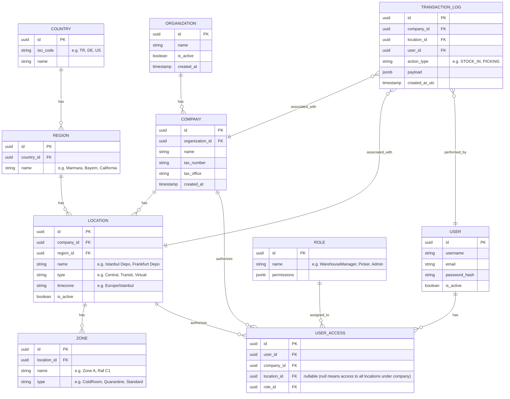
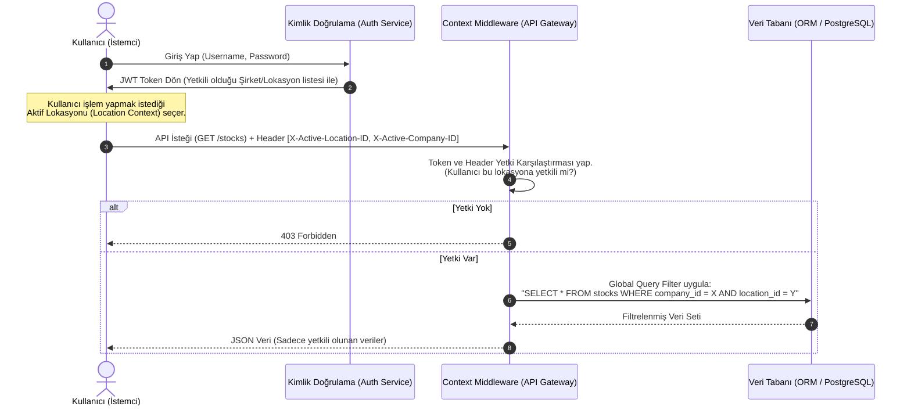

# İş İsteri 1: Organizasyonel Yapı ve Çoklu Lokasyon Mimarisi
Bu teknik tasarım, LLM modellerinin doğrudan kod üretebileceği düzeyde detaylandırılmış veri modellerini, iş kurallarını ve veri akış diyagramlarını içermektedir.

---

## 1. Veri Modeli ve Veri Tabanı Şeması (Entity Relationship Diagram - ERD)

Çoklu firma ve lokasyon yapısının esnek ve genişletilebilir olması için hiyerarşik bir veritabanı şeması tasarlanmıştır.

### Şema Tasarım Kuralları:
1. **Yumuşak Silme (Soft Delete):** `is_active` alanı tüm ana tablolarda bulunmalı, fiziksel silme yapılmamalıdır.
2. **Denetim İzi (Audit Log):** Her kritik işlem kaydında (`TRANSACTION_LOG`) işlemin gerçekleştiği `company_id` ve `location_id` zorunlu (NOT NULL) olarak tutulmalıdır.
3. **Esnek Hiyerarşi:** `USER_ACCESS` tablosundaki `location_id` alanı boş (`null`) bırakılabilir. Eğer boş bırakılırsa, kullanıcı o şirkete ait tüm lokasyonlarda (depolarda) işlem yapma yetkisine sahip olur.

---

## 2. Teknik Akış ve Veri İzolasyon Mimarisi (Data Flow)

Kullanıcının sisteme giriş yapmasından veriye erişmesine kadar geçen süreçte **Çoklu Lokasyon İzolasyonu** (Multi-Location Isolation) aşağıdaki gibi uygulanır:

---

## 3. Teknik İş Kuralları (Technical Business Rules)

LLM modelinin bu yapıyı oluştururken uyması gereken kurallar:

1. **Context Injector (Bağlam Enjektörü):** API katmanında her istek geldiğinde, HTTP Header'dan gelen `X-Active-Location-ID` ve `X-Active-Company-ID` bilgileri okunmalı ve isteğe özel bir thread-local context'e (veya request context) aktarılmalıdır.
2. **Global Query Filter (Küresel Sorgu Filtresi):** ORM (Entity Framework, Prisma, Hibernate vb.) seviyesinde, işlem gören tablolarda (Örn: Stok, Sipariş, Sayım) `company_id` ve `location_id` alanları için otomatik filtre uygulanmalıdır. Geliştirici manuel olarak `WHERE` koşulu yazmak zorunda kalmamalıdır.
3. **İşlem Kayıtlarında Loglama (Transaction Tracking):** Sisteme kaydedilen her stok hareketi veya sipariş kaydında, aktif kullanıcı ID'sinin yanı sıra aktif `company_id` ve `location_id` veri tabanına zorunlu alan olarak yazılmalıdır.
4. **Çapraz Depo Transferi İstisnası (Cross-Warehouse Transfer):** Depolar arası transferlerde, kaynak depo ve hedef depo olmak üzere iki farklı lokasyon bulunur. Bu özel senaryoda, kullanıcının hem kaynak hem de hedef depoya yetkisi olması gerektiği API katmanında doğrulanmalıdır.
