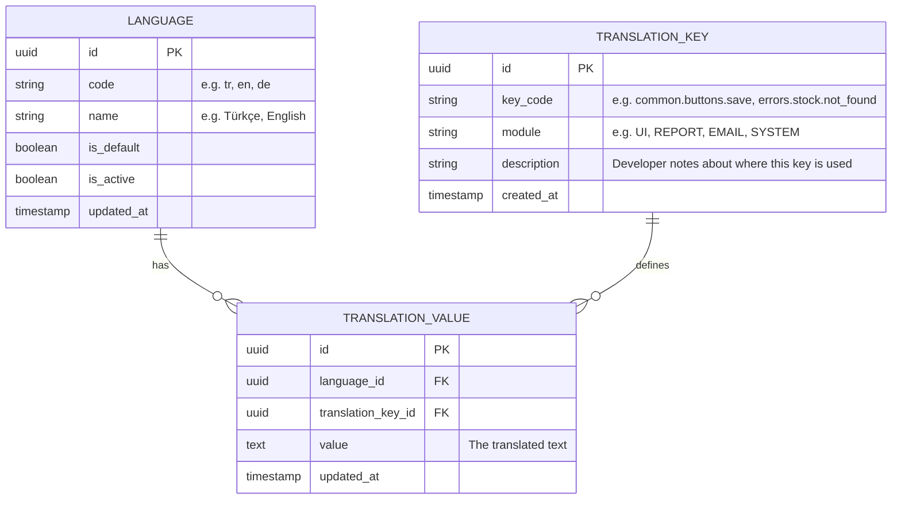
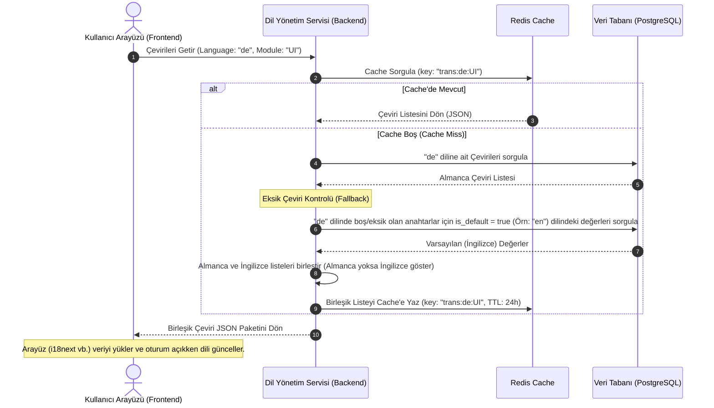

# İş İsteri 2: Çok Dilli Arayüz ve Raporlama Altyapısı
Bu teknik tasarım, LLM modellerinin doğrudan dinamik dil yönetimi, caching, fallback ve raporlama çevirileri modüllerini kodlayabilmesi için gereken teknik altyapıyı tanımlar.

---

## 1. Veri Modeli ve Veri Tabanı Şeması (ERD)

Sistemdeki tüm metinlerin (ekranlar, menüler, raporlar, hata mesajları, e-posta şablonları) dinamik olarak yönetilebilmesi için normalleştirilmiş bir çeviri şeması kullanılır.

### Şema Tasarım Kuralları:
1. **Benzersiz Key Kısıtı (Unique Constraint):** `translation_key_id` ve `language_id` çifti `TRANSLATION_VALUE` tablosunda benzersiz (UNIQUE) olmalıdır.
2. **Hızlı Erişim İndeksi:** `TRANSLATION_KEY` tablosundaki `key_code` ve `module` alanları üzerinde indeks (Index) tanımlanmalıdır.

---

## 2. Caching ve Fallback Akış Mimarisi

Dil dosyalarının hızlı yüklenmesi ve her sayfa geçişinde veri tabanına yük bindirilmemesi için **Redis Caching** ve **Varsayılan Dil (Fallback)** mekanizması uygulanır.

---

## 3. Teknik İş Kuralları (Technical Business Rules)

LLM modelinin bu yapıyı oluştururken uyması gereken kurallar:

1. **Kodsuz Yeni Dil Ekleme (No-Code Language Add):** Sisteme yeni bir dil eklendiğinde (`LANGUAGE` tablosuna kayıt atıldığında), veritabanındaki tüm `TRANSLATION_KEY` kayıtları için otomatik olarak `TRANSLATION_VALUE` tablosuna boş değerler (veya varsayılan dilden kopyalar) üreten bir veritabanı tetikleyicisi (trigger) veya servis metodu çalışmalıdır.
2. **Çeviri Import/Export Servisi:** Çeviriler toplu olarak Excel veya JSON formatında dışa aktarılabilmeli (export) ve güncellenmiş dosya sisteme geri yüklenebilmelidir (import). Import işlemi sırasında mevcut cache temizlenmelidir (Cache Eviction).
3. **Eksik Çeviri Raporlama (Missing Translation Auditor):** Arayüz veya sistem bir dili yüklerken eğer belirli bir `key_code` bulunamazsa, sistem arka planda bu durumu yakalayıp loglamalıdır. Bu sayede admin panelinde "Eksik Çeviriler Raporu" oluşturulabilir.
4. **Rapor Şablonu Çevirileri (Report Localization):** PDF, Excel veya CSV formatında üretilen tüm raporların başlıkları ve sütun adları, API katmanında rapor oluşturma tetiklendiğinde kullanıcının o anki aktif dil parametresine göre `TRANSLATION_VALUE` tablosundan sorgulanarak yerleştirilmelidir.
