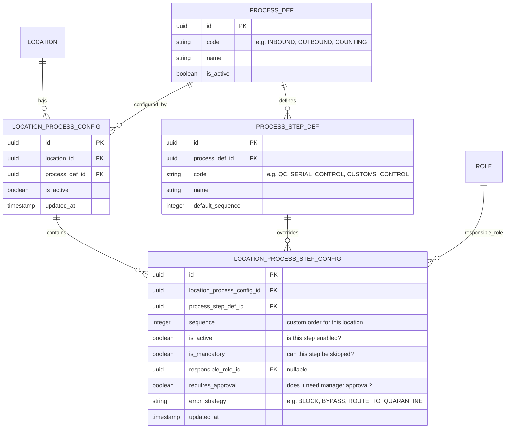
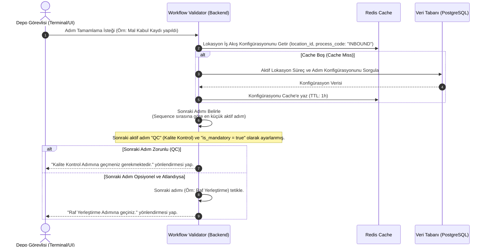

# İş İsteri 3: Lokasyon Bazlı Parametrik Süreç Konfigürasyonu
Bu teknik tasarım, LLM modellerinin yazılım geliştirmeye (kod değişikliğine) gerek kalmadan depo iş akışı adımlarını (Mal Kabul, Kalite Kontrol, Paketleme vb.) lokasyon bazlı parametrik olarak çalıştırabilen bir iş akışı motoru (Workflow Engine) tasarlamasını sağlar.

---

## 1. Veri Modeli ve Veri Tabanı Şeması (ERD)

İş akışı adımlarının dinamik olarak sıralanması, zorunlu/opsiyonel durumları ve onay mekanizmaları için aşağıdaki şema tasarlanmıştır.

### Şema Tasarım Kuralları:
1. **Sıralama Garantisi (Sequence Control):** `LOCATION_PROCESS_STEP_CONFIG` tablosunda `location_process_config_id` ve `sequence` alanları üzerinde benzersizlik kontrolü (Unique Constraint) veya dinamik bir doğrulama bulunmalıdır; aynı iş akışında iki adım aynı sırada olamaz.
2. **Hata Stratejileri (Error Strategy):** `error_strategy` alanı, bir adımda hata veya tolerans dışı durum oluştuğunda sistemin ne yapacağını tanımlar (`BLOCK`: Süreci kilitle, `ROUTE_TO_QUARANTINE`: Malı karantinaya yönlendir ve devam et, `BYPASS`: Uyarı verip devam et).

---

## 2. Dinamik Süreç Doğrulama Akışı (Runtime Flow)

İşlem anında (Örn: Mal Kabul esnasında) sistemin lokasyon bazlı kuralları nasıl sorguladığı ve doğruladığı aşağıdaki süreç akışında gösterilmiştir:

---

## 3. Teknik İş Kuralları (Technical Business Rules)

LLM modelinin bu yapıyı oluştururken uyması gereken kurallar:

1. **Yazılımsız Akış Değişikliği (No-Code Flow Customization):** Lokasyon adminleri, kod yazmaya gerek kalmadan adımların sırasını (`sequence` değerini değiştirerek) güncelleyebilmeli veya bir adımı kapatabilmelidir (`is_active = false`).
2. **Audit Logging (Denetim İzi):** `LOCATION_PROCESS_STEP_CONFIG` tablosunda yapılan herhangi bir güncelleme (Örn: Kalite kontrolün pasif yapılması veya onay gereksiniminin açılması) kimin tarafından yapıldığı, eski değer ve yeni değer bilgileriyle birlikte **System Audit Log** tablosuna kaydedilmelidir.
3. **Rol Bazlı Yetki Kontrolü:** Eğer bir adım için `responsible_role_id` tanımlanmışsa, o adımı sadece o role sahip kullanıcılar gerçekleştirebilmelidir. Aksi takdirde API `403 Unauthorized` hatası vermelidir.
4. **Onay Mekanizması Tetikleyicisi (Approval Interceptor):** `requires_approval = true` olan adımlarda, işlem tamamlanmaya çalışıldığında sistem işlemi "Aşama Onayı Bekliyor" (Pending Approval) durumuna almalı ve ilgili yöneticilere bildirim/onay isteği göndermelidir.
