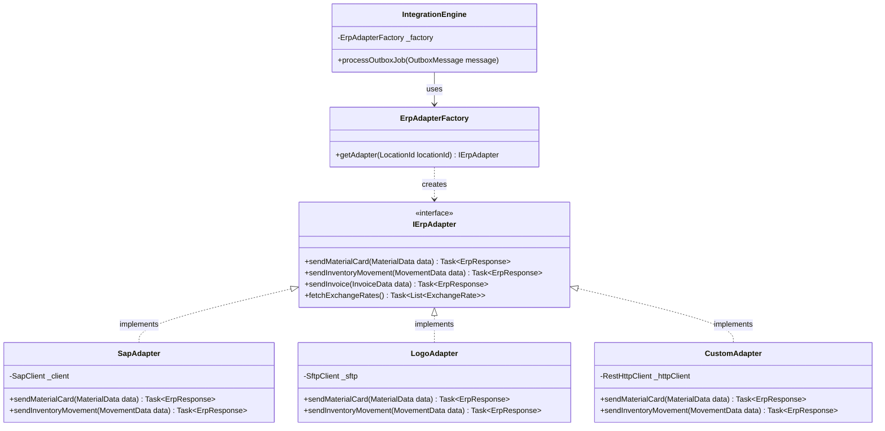
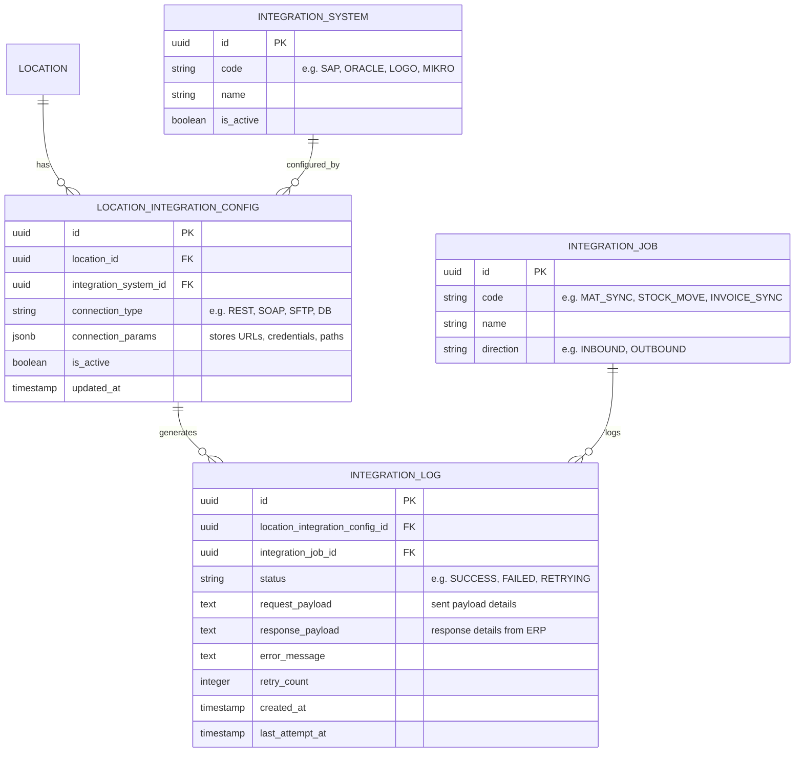
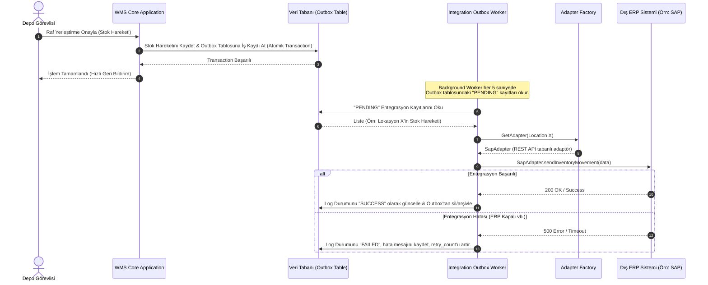

# İş İsteri 4: ERP / Muhasebe / Finans Entegrasyon Altyapısı
Bu teknik tasarım, LLM modellerinin farklı lokasyonlardaki farklı ERP sistemleriyle (SAP, Oracle, Logo vb.) esnek, hata toleranslı ve izlenebilir bir entegrasyon kurmasını sağlayan mimariyi tanımlar.

---

## 1. Yazılım Tasarım Deseni: Adaptör Deseni (Adapter Pattern)

Sistemin tek bir ERP'ye bağımlı kalmaması ve lokasyon bazlı farklı entegrasyon adaptörlerini dinamik olarak çağırabilmesi için **Adapter Pattern** yapısı uygulanır.

---

## 2. Entegrasyon Veri Tabanı Şeması (ERD)

Entegrasyonların yapılandırılması, loglanması ve yeniden deneme (retry) süreçlerinin takibi için kullanılan veri tabanı şemasıdır.

---

## 3. Asenkron Entegrasyon Akışı: Outbox Pattern

İşlem anında WMS uygulamasının performansının düşmemesi ve ERP sisteminin kesintili olduğu durumlarda veri kaybı yaşanmaması için **Outbox Pattern** uygulanır.

---

## 4. Teknik İş Kuralları (Technical Business Rules)

LLM modelinin bu yapıyı oluştururken uyması gereken kurallar:

1. **Gevşek Bağlılık (Decoupling):** WMS veritabanındaki stok hareketleri tablosu doğrudan ERP tablolarıyla ilişkili olmamalıdır. Veri alışverişi sadece DTO'lar (Data Transfer Objects) ve adaptör arayüzü (`IErpAdapter`) üzerinden yapılmalıdır.
2. **Hata ve Yeniden Deneme (Retry Mechanism):** Entegrasyon hatalarında, sistem log durumunu `FAILED` olarak işaretlemelidir. Admin panelinde bu hatalı kayıtlar için bir "Yeniden Gönder" (Resend/Retry) butonu bulunmalı ve tıklandığında ilgili outbox kaydı tekrar tetiklenmelidir. Ayrıca geçici ağ hataları için 3 kez otomatik yeniden deneme (exponential backoff) mekanizması bulunmalıdır.
3. **Payload Arşivleme:** Gönderilen verinin birebir kopyası (`request_payload`) ve alınan hata/başarı mesajı (`response_payload`) ileride yaşanabilecek uyuşmazlıkların denetimi (Audit/Traceability) için metin olarak veri tabanında saklanmalıdır.
4. **Yeni Adaptör Ekleme Kolaylığı:** Yeni bir ERP sistemi entegre edilmek istendiğinde (`IErpAdapter` arayüzünü implement eden yeni bir sınıf oluşturulup factory'e eklendiğinde) mevcut WMS kodlarında ve diğer adaptörlerin yapısında hiçbir değişiklik olmamalıdır (Open/Closed Principle).
