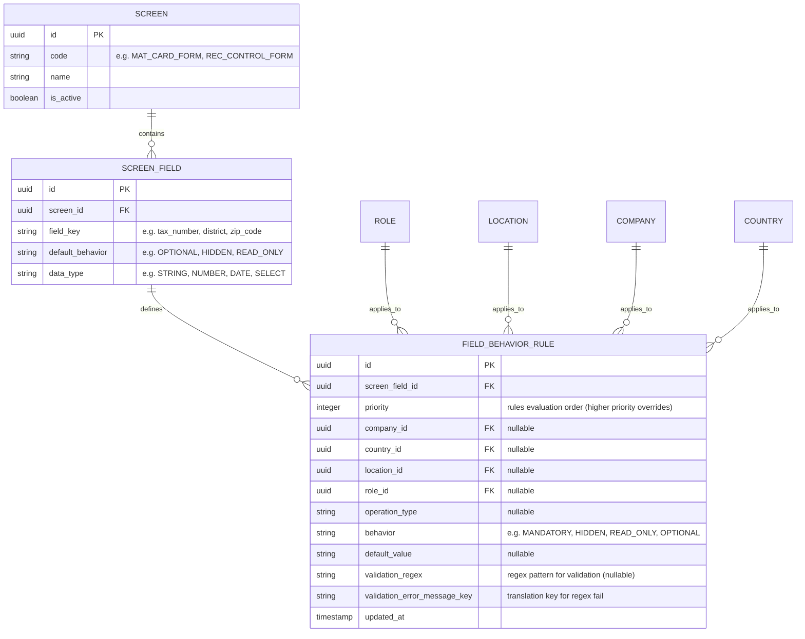
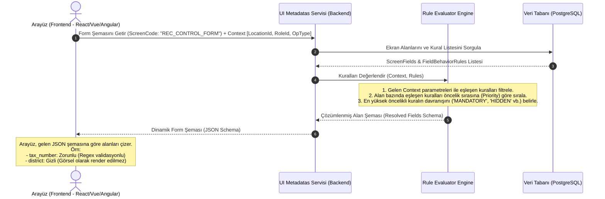

# İş İsteri 5: Dinamik Ekran Alanı ve Yetki Yönetimi
Bu teknik tasarım, LLM modellerinin ekranlardaki alanların (veri giriş kutuları, butonlar vb.) lokasyona, kullanıcı rolüne ve işlem tipine göre dinamik olarak görünürlüğünü, zorunluluğunu ve salt okunurluğunu yönetebileceği bir **Dinamik UI Motoru** (Dynamic UI Engine) oluşturmasını sağlar.

---

## 1. Veri Modeli ve Veri Tabanı Şeması (ERD)

Ekranlar, bu ekranlardaki alanlar ve alanların farklı koşullardaki davranış kurallarını saklamak için tasarlanan veri şemasıdır.

### Şema Tasarım Kuralları:
1. **Esnek Koşullar (Flexible Conditions):** `FIELD_BEHAVIOR_RULE` tablosundaki tüm bağlamsal alanlar (`company_id`, `country_id`, `location_id`, `role_id`, `operation_type`) boş bırakılabilir (`nullable`). Boş bırakılan alanlar "Herhangi bir durum/Herkes için geçerli" anlamına gelir.
2. **Öncelik Yönetimi (Priority):** Çakışan kuralları çözmek için `priority` değeri kullanılır (Örn: Ülke seviyesinde "İlçe zorunlu" kuralının önceliği `10` iken, belirli bir lokasyonda "İlçe gizli" kuralının önceliği `20` yapılarak lokasyon kuralının ülke kuralını ezmesi sağlanır).

---

## 2. Dinamik Ekran Şeması Çözümleme Akışı (Runtime Flow)

İstemci (Arayüz) bir formu yüklemek istediğinde arka planda çalışan kural değerlendirme akışıdır:

---

## 3. Teknik İş Kuralları (Technical Business Rules)

LLM modelinin bu yapıyı oluştururken uyması gereken kurallar:

1. **JSON Şeması Standardı (Form Schema Generation):** Backend, çözümlenmiş formu standart bir JSON Schema (veya React Hook Form / Formik ile uyumlu bir JSON yapısı) olarak dönmelidir. Bu sayede frontend üzerinde statik form kodlaması yapılmasına gerek kalmaz.
2. **Çift Yönlü Doğrulama (Server-side Validation):** Dinamik alan kuralları sadece frontend üzerinde görsel olarak çalışmamalıdır; veritabanına kayıt atılırken de (`POST /save-data`) backend aynı kuralları (Örn: `validation_regex` ve `MANDATORY` alanları) tekrar değerlendirmeli ve kurala uymayan verileri `400 Bad Request` ile reddetmelidir.
3. **Kural Çakışması Engelleme (Conflict Prevention):** Admin panelinde yeni kural eklenirken, aynı öncelik değerine (`priority`) sahip çakışan bağlamların oluşması engellenmeli veya sistem varsayılan öncelik hiyerarşisi atamalıdır (Hiyerarşi: Lokasyon > Rol > Şirket > Ülke > Varsayılan).
4. **Çeviri Entegrasyonu:** Alan etiketleri (label) doğrudan statik metin olarak değil, `SCREEN_FIELD` tablosundaki `field_key` değeri `TranslationKey` tablosuyla ilişkilendirilerek dille uyumlu şekilde dönmelidir.
