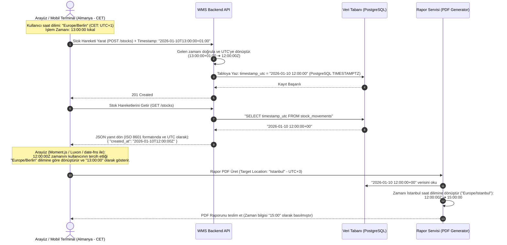

# İş İsteri 6: Saat Dilimi (Timezone) Yönetimi
Bu teknik tasarım, LLM modellerinin uluslararası çalışacak WMS sisteminde zaman kaymalarını (date-shift) ve raporlama hatalarını önleyen, tutarlı bir saat dilimi (timezone) altyapısı kurmasını sağlar.

---

## 1. Veri Tabanı Saklama ve Zaman Dönüşüm Mimarisi

Zaman verilerinin veri tabanında tutarlı şekilde saklanması ve kullanıcı arayüzü (Frontend) ile sunucu taraflı raporlarda doğru saat dilimiyle gösterilmesi için aşağıdaki dönüşüm akışı uygulanır.

---

## 2. İlişkili Veri Tabanı Alanları (Veri Modeli Katkısı)

Önceki hiyerarşik veri tabanımıza ek olarak saat dilimi yönetiminde kullanılan kritik alanlar:

* **`LOCATION.timezone` (VARCHAR):** Deponun fiziksel olarak bulunduğu yerin IANA saat dilimi adı (Örn: `Europe/Istanbul`, `Europe/London`, `Asia/Dubai`).
* **`USER.preferred_timezone` (VARCHAR - Nullable):** Kullanıcının kişisel ekranında tercih ettiği saat dilimi. Boşsa, kullanıcının çalıştığı aktif deponun (`LOCATION.timezone`) saat dilimi baz alınır.
* **Tüm Zaman Alanları (TIMESTAMPTZ):** Stok hareketleri, sipariş tarihleri, denetim kayıtları gibi tüm işlem tarihleri veri tabanında kesinlikle `TIMESTAMPTZ` (Timestamp with time zone) veya UTC standardında `TIMESTAMP` veri tipinde saklanmalıdır.

---

## 3. Teknik İş Kuralları (Technical Business Rules)

LLM modelinin bu yapıyı oluştururken uyması gereken kurallar:

1. **İstemci Tarafı Dönüştürme Prensibi (Client-Side Rendering):** API servisleri her zaman tarih-saat verilerini ISO 8601 standardında UTC zaman bilgisiyle (`Z` sonekiyle, örn: `2026-07-03T11:14:00Z`) dönmelidir. İstemci (Frontend/Mobil), bu veriyi cihazın lokal timezone'una veya kullanıcının profilindeki `preferred_timezone` değerine göre ekranda biçimlendirmelidir.
2. **Sunucu Tarafı Raporlama (Server-Side Conversion):** Sunucuda üretilen PDF, Excel veya otomatik e-posta bildirimlerinde, zaman dönüştürme işlemi tetiklenmeli ve belgenin ait olduğu **Deponun (Location)** veya alıcı kullanıcının saat dilimi (`LOCATION.timezone`) kullanılmalıdır.
3. **Yaz Saati Desteği (Daylight Saving Time):** Saat dilimi hesaplamalarında statik saat farkları (Örn: UTC+3) kullanılmamalıdır. Bunun yerine, kütüphanelerde IANA Saat Dilimi veri tabanı (tz database) kullanılmalı (Örn: C# için `TimezoneInfo`, Java için `ZoneId`, Node.js için `Luxon`), böylece yaz saati geçişleri sistem tarafından otomatik yönetilmelidir.
4. **Kritik Gün Geçişi Kontrolleri (Date Shift Prevention):** Gün sonu raporları veya envanter sayımları gibi tarih bazlı filtrelemelerde (Örn: "2026-01-10 tarihindeki işlemler"), tarih filtresi istemciden UTC olarak değil, lokasyonun yerel saatine göre gün başlangıcı (`00:00:00`) ve gün bitişi (`23:59:59`) olarak hesaplanıp API'ye iletilmelidir (Örn: İstanbul için `2026-01-09T21:00:00Z` ile `2026-01-10T20:59:59Z` aralığı sorgulanmalıdır).
