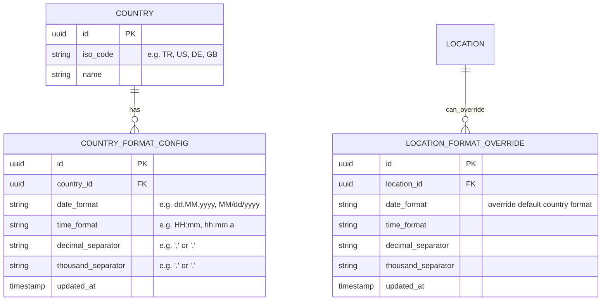
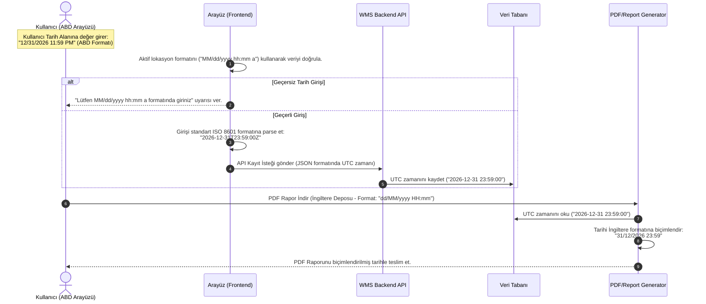

# İş İsteri 7: Uluslararası Tarih ve Saat Formatları
Bu teknik tasarım, LLM modellerinin kullanıcı girişlerinde (input) ve ekran/rapor çıktılarında ülkelere göre değişen tarih/saat biçimlendirmelerini (Örn: `31.12.2026` vs. `12/31/2026`) esnek bir şekilde yönetebilmesi için gereken biçimlendirme mimarisini tanımlar.

---

## 1. Veri Modeli ve Veri Tabanı Şeması (ERD)

Ülke bazında tarih, saat ve sayısal format kurallarını (ondalık/binlik ayraçlar dahil) tanımlamak için kullanılan veritabanı şemasıdır.

### Şema Tasarım Kuralları:
1. **Varsayılan ve Özel Ayarlar:** Lokasyon seviyesindeki `LOCATION_FORMAT_OVERRIDE` tablosu, eğer bir deponun bağlı olduğu ülkeden farklı özel bir format gereksinimi varsa kullanılır. Boş ise ülkenin varsayılanı geçerlidir.
2. **Sayısal Format Desteği:** Sayısal değerler (Örn: Miktar, vergi tutarları, fiyatlar) için `decimal_separator` ve `thousand_separator` eklenmiştir. Bu alanlar tarih/saat biçimlendirmesi ile doğrudan ilişkilidir (Lokalizasyon bütünlüğü).

---

## 2. Giriş ve Çıktı Biçimlendirme Akışı (Data Flow)

Arayüzde kullanıcının kendi formatıyla girdiği tarihin doğrulanması ve sunucuda basılan raporlarda formatın uygulanması akışıdır:

---

## 3. Teknik İş Kuralları (Technical Business Rules)

LLM modelinin bu yapıyı oluştururken uyması gereken kurallar:

1. **Standardize API İletişimi (ISO 8601):** API katmanı (JSON istek ve yanıtları) asla lokal formatlarda tarih verisi taşımamalıdır. İletişim her zaman `YYYY-MM-DDTHH:mm:ss.sssZ` formatında olmalıdır. Lokal formatlama sadece UI render anında veya server-side dosya (PDF/Excel) oluşturma anında yapılmalıdır.
2. **Kullanıcı Giriş Doğrulaması (Frontend Parsing):** Kullanıcı arayüzündeki tarih seçim bileşenleri (date-picker) ve elle giriş maskeleri, aktif lokasyonun konfigürasyonundan gelen `date_format` ve `time_format` desenlerini dinamik olarak almalı ve bu desenlere göre input validation yapmalıdır.
3. **Raporlama Kütüphanesi Entegrasyonu:** Rapor üretme servisleri (Örn: JasperReports, iText, Puppeteer PDF) tarih basarken, ilgili veritabanındaki format tablosundan sorgulanan format parametresini alarak tarih/saat/sayı dönüşümlerini yapmalıdır.
4. **Sayı Biçimlendirme Kuralları:** Fiyat ve miktarların gösteriminde de ilgili lokasyonun ondalık (`decimal_separator`) ve binlik (`thousand_separator`) ayıraç kurallarına uyulmalıdır (Örn: Türkiye için `1.250,50 TRY`, ABD için `1,250.50 USD`).
