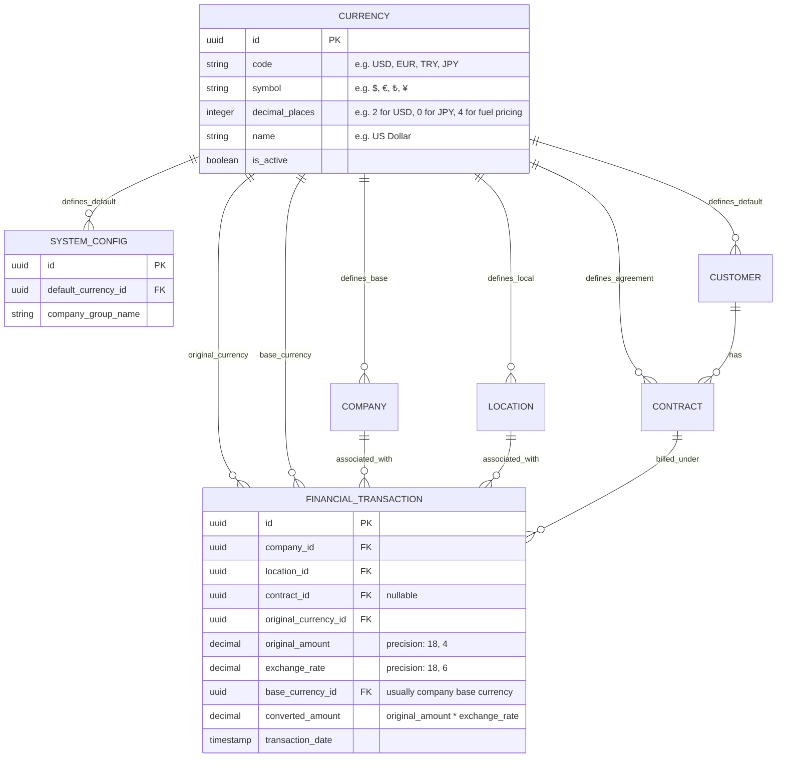
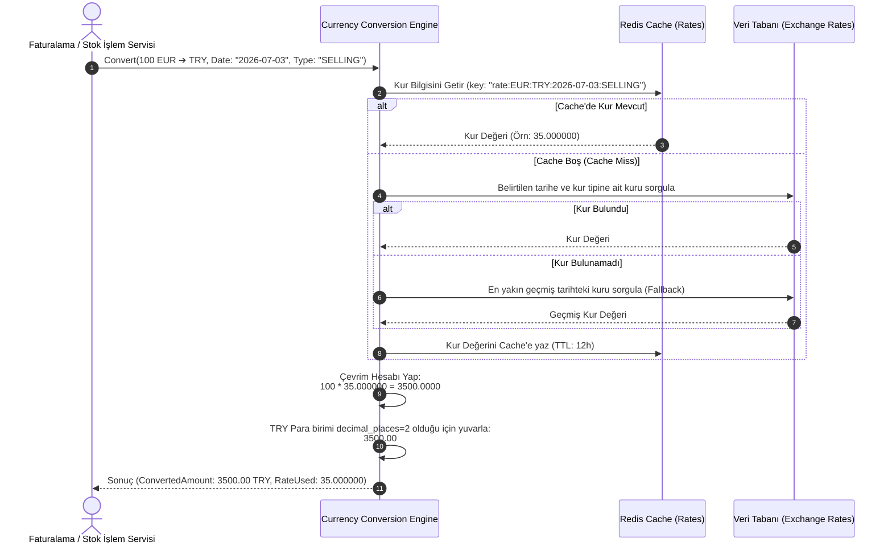

# İş İsteri 8: Çoklu Para Birimi Yönetimi
Bu teknik tasarım, LLM modellerinin finansal işlemler, faturalama ve raporlamalarda kullanılacak çoklu para birimi altyapısını, kuruş/cent hassasiyetlerini ve çevrim algoritmalarını hatasız kodlayabilmesi için gereken mimariyi tanımlar.

---

## 1. Veri Modeli ve Seviye Bazlı Para Birimi Hiyerarşisi (ERD)

Para biriminin sistemin farklı seviyelerinde (Sistem, Şirket, Depo, Müşteri, Fatura, Muhasebe vb.) nasıl tanımlandığını ve finansal hareketlerin nasıl saklandığını gösteren şemadır.

### Şema Tasarım Kuralları:
1. **Decimal Hassasiyeti (Exact Decimals):** Finansal hesaplamalarda yuvarlama hatalarını önlemek için veri tabanındaki tüm miktar (`amount`) ve oran (`rate`) alanları `DECIMAL` (örneğin SQL'de `DECIMAL(18, 4)` tutarlar için, `DECIMAL(18, 6)` döviz kurları için) veri tipinde tanımlanmalı, asla `float` veya `double` kullanılmamalıdır.
2. **Çift Para Birimi Depolama (Dual-Currency Storage):** Her finansal işlemde, işlemin yapıldığı orijinal tutar ve para birimi ile birlikte, o anki kur üzerinden hesaplanmış şirket ana para birimi (`base_currency_id`) cinsinden karşılığı (`converted_amount`) mutlaka saklanmalıdır.

---

## 2. Döviz Çevrimi ve Kur Sorgulama Akışı (Runtime Flow)

Bir finansal hareket oluşturulurken sistemin doğru kuru seçmesi ve tutarları hesaplama akışıdır:

---

## 3. Teknik İş Kuralları (Technical Business Rules)

LLM modelinin bu yapıyı oluştururken uyması gereken kurallar:

1. **Yuvarlama Kuralları (Banker's Rounding):** Finansal yuvarlamalarda standart yukarı yuvarlama yerine, finans sektör standardı olan "Banker's Rounding" (MidpointRounding.ToEven) algoritması kullanılmalıdır.
2. **Tarih Bazlı Kur Geçmişi Sorgusu (Point-in-Time Rate):** Geriye dönük bir işlem yapıldığında (Örn: 3 gün önceki bir sevkiyat faturası), bugünün kuru değil, **işlemin gerçekleştiği tarihteki kur** (`transaction_date`) baz alınmalıdır.
3. **Eksik Kur Fallback Kuralı (Bypass Strategy):** Eğer işlem gününe ait bir kur bulunamazsa, sistem bir önceki günün kurunu kullanmalı ancak bu durumu işlem logunda "Alternatif Kur Kullanıldı" bayrağıyla işaretlemeli ve yöneticiye uyarı göndermelidir.
4. **Çoklu Seviye Para Birimi Çözümleme Hiyerarşisi:** Bir işlemin para birimi belirlenirken aşağıdaki öncelik sırası uygulanmalıdır:
   * 1. Öncelik: İşlemin doğrudan bağlı olduğu **Sözleşme/Fatura Para Birimi** (`CONTRACT.currency_id`).
   * 2. Öncelik: İlişkili **Müşteri Kartındaki Para Birimi** (`CUSTOMER.default_currency_id`).
   * 3. Öncelik: İşlemin yapıldığı **Depo Yerel Para Birimi** (`LOCATION.currency_id`).
   * 4. Öncelik: **Şirket Ana Para Birimi** (`COMPANY.currency_id`).
