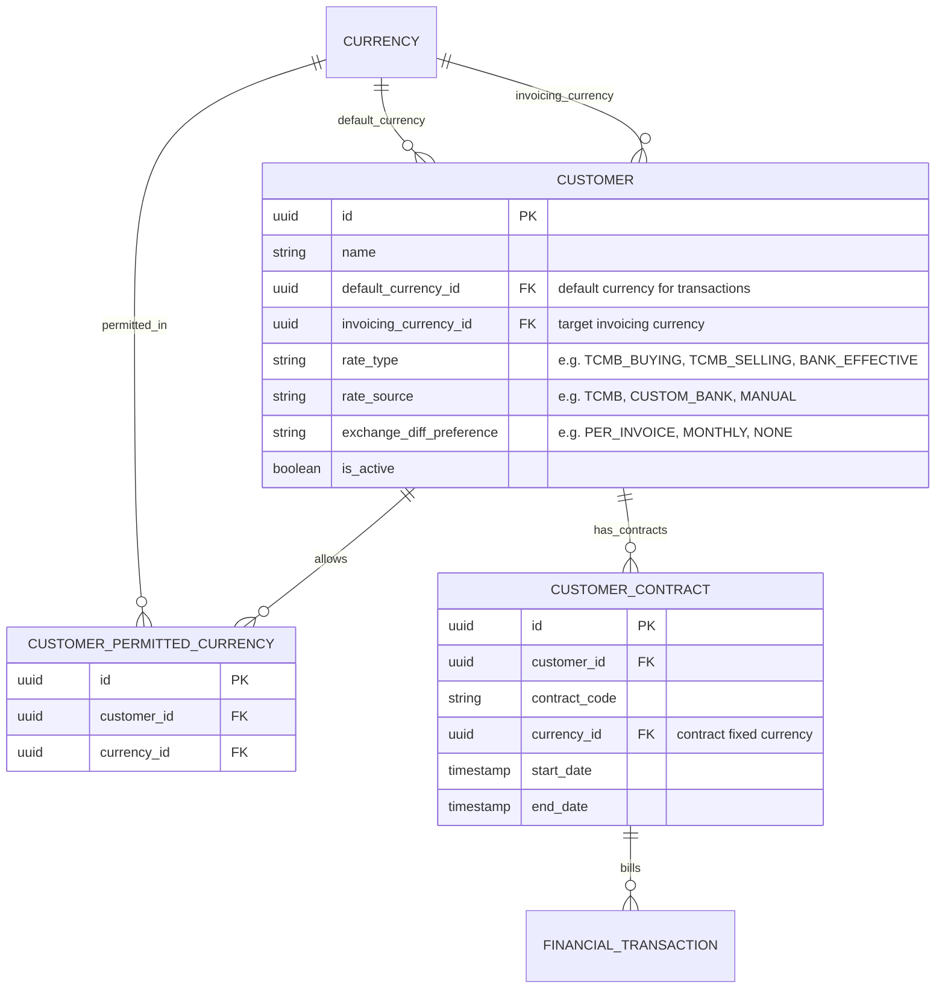
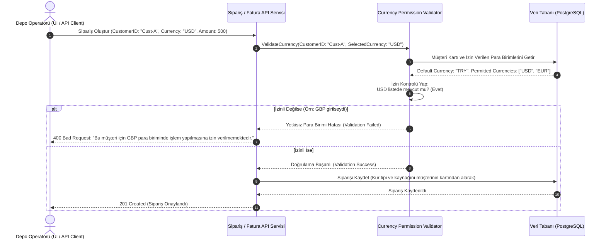

# İş İsteri 9: Müşteri Bazlı Para Birimi Tanımları
Bu teknik tasarım, LLM modellerinin her bir müşteri için izin verilen döviz limitlerini, kur tiplerini ve kur kaynağı ayarlarını yönetebileceği ve sipariş/faturalama anında bu kuralları doğrulayan doğrulama sistemini (Validation Engine) kodlaması için gereken mimariyi tanımlar.

---

## 1. Veri Modeli ve Müşteri Para Birimi Konfigürasyonu (ERD)

Müşteri kartı üzerinde para birimi kısıtlamalarını ve döviz kurallarını esnek şekilde tutmak için tasarlanan şemadır.

### Şema Tasarım Kuralları:
1. **Benzersiz İzinler (Permitted Currencies Isolation):** `CUSTOMER_PERMITTED_CURRENCY` tablosunda `customer_id` ve `currency_id` ikilisi benzersiz (UNIQUE) olmalıdır. Müşterinin varsayılan para birimi (`default_currency_id`) bu tabloya eklenmeksizin de otomatik olarak izinli kabul edilmelidir.
2. **Sözleşme Kilitleri (Contract Currencies):** Müşteri ile yapılan sözleşmelerde (`CUSTOMER_CONTRACT`) belirlenen para birimi, müşterinin izin verilen para birimleri listesinden seçilmek zorundadır.

---

## 2. Para Birimi Geçerlilik ve Doğrulama Akışı (Runtime Validation)

Bir operatör müşteri adına yeni bir Sipariş (Order) veya Fatura oluşturmak istediğinde sistemin yürüttüğü doğrulama akışı:

---

## 3. Teknik İş Kuralları (Technical Business Rules)

LLM modelinin bu yapıyı oluştururken uyması gereken kurallar:

1. **İzin Kontrolü Filtresi (Request Filter):** Sipariş girişleri, fatura kayıtları ve teklifler gibi tüm finansal girdi noktalarında `CurrencyPermissionValidator` çalıştırılmalıdır. Müşterinin varsayılan para birimi (`default_currency_id`) ve izinli dövizler listesi (`CUSTOMER_PERMITTED_CURRENCY`) dışındaki bir para birimiyle gelen tüm istekler veri tabanına yazılmadan hata ile sonlandırılmalıdır.
2. **Kur Farkı Hesaplama Tercihi (Exchange Difference Preference):** Müşteri kartındaki `exchange_diff_preference` alanına göre sistem faturalarda kur farkı faturası tetikleyip tetiklemeyeceğini belirlemelidir:
   * `PER_INVOICE`: Her fatura kesiminde kur farkı hesaplanır ve kaydedilir.
   * `MONTHLY`: Ay sonunda cari hesap hareketleri taranarak toplu kur farkı mahsubu oluşturulur.
   * `NONE`: Kur farkı hesaplanmaz.
3. **Müşteri Özel Kur Tipleri:** Sistem döviz kurunu çekerken (İş İsteri 8'deki kur motoru aracılığıyla), ilgili müşterinin kartında tanımlı olan `rate_type` (Alış, Satış, Efektif) ve `rate_source` (TCMB, Banka vb.) parametrelerini kullanarak doğru kuru dinamik olarak çekmelidir.
4. **Sözleşme Uyum Kontrolü:** Müşteriye ait bir sözleşme seçildiğinde, sipariş veya faturanın para birimi otomatik olarak sözleşmedeki para birimiyle kilitlenmeli, kullanıcının elle para birimi değiştirmesine izin verilmemelidir.
