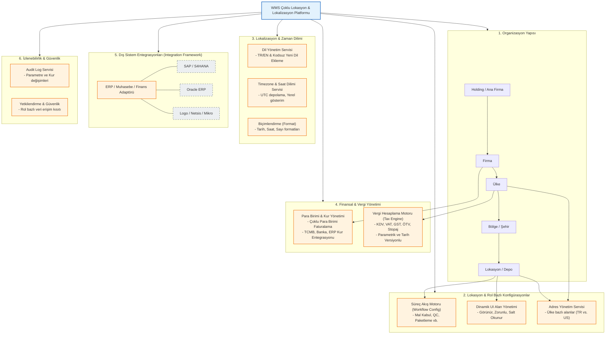

# Depo Yönetim Sistemi (WMS) - Lokalizasyon ve Çoklu Lokasyon Projesi İş İsterleri Analizi

Bu doküman, geliştirilecek **Depo Yönetim Sistemi (WMS)** uygulamasının farklı coğrafyalarda, farklı şirket yapılarında, farklı zaman dilimlerinde ve yerel mevzuatlarda çalışabilmesi için gerekli olan temel iş isterlerini (Business Requirements) özetlemektedir.

---

## İş İsterleri ve Modül İlişkileri Diyagramı

Aşağıdaki diyagram, sistemin organizasyon yapısını, parametrik konfigürasyonlarını, lokalizasyon modüllerini ve dış sistemlerle ilişkilerini görselleştirmektedir:

---

## 1. Organizasyonel Yapı ve Çoklu Lokasyon Desteği
Sistem, tek bir WMS platformu üzerinden birden fazla firmanın ve bu firmalara bağlı farklı ülkelerdeki depoların yönetilmesini desteklemelidir.

* **Hiyerarşik Yapı:** Sistem; *Ana Firma/Holding ➔ Firma ➔ Ülke ➔ Bölge ➔ Şehir ➔ Lokasyon ➔ Depo ➔ Alt Depo/Zone* kırılımlarını desteklemelidir.
* **Yetkilendirme:** Kullanıcılar yalnızca yetkili oldukları firma ve lokasyonların verilerini görebilmeli ve işlem yapabilmelidir.
* **Dinamik Davranış:** Seçilen lokasyona göre ekranlar, süreçler, raporlar ve operasyonel kurallar dinamik olarak değişmelidir.

---

## 2. Çok Dilli Arayüz ve Raporlama Desteği
Uluslararası operasyonlarda farklı dillerde kullanım imkanı sağlanmalıdır.

* **Dil Desteği:** Başlangıçta **Türkçe** ve **İngilizce** standart olarak sunulmalı; yeni diller kod değişikliği gerekmeden (dil dosyası yükleyerek) eklenebilmelidir.
* **Dil Değişimi:** Kullanıcı oturumu kapatmadan (on-the-fly) dil değiştirebilmelidir.
* **Kapsam:** Menü adları, ekran başlıkları, alan etiketleri, butonlar, hata/uyarı mesajları, rapor başlıkları/kolonları ve e-posta şablonları dil desteğine dahil olmalıdır.

---

## 3. Lokasyon Bazlı Süreç Konfigürasyonu
Farklı lokasyonlardaki operasyonel süreçlerin parametrik olarak özelleştirilebilmesi gerekir.

* **Esnek Süreç Adımları:** Mal kabul, kalite kontrol, seri no kontrolü, lot/batch kontrolü, gümrük kontrolü, etiketleme, paketleme, sayım, sevkiyat ve faturalama gibi adımlar lokasyon bazında aktif/pasif veya zorunlu/opsiyonel yapılabilmelidir.
* **Yazılımsız Yönetim:** Bu süreç değişiklikleri yazılım geliştirmeye ihtiyaç duymadan parametrik olarak yapılmalı ve yapılan her değişiklik **Audit Log** sisteminde izlenmelidir.

---

## 4. ERP / Muhasebe / Finans Entegrasyonları
Sistem, farklı lokasyonlarda kullanılan çeşitli ERP ve muhasebe sistemleriyle esnek bir şekilde entegre olabilmelidir.

* **Desteklenen Sistemler:** SAP, SAP S/4HANA, Oracle ERP, Microsoft Dynamics, Logo, Netsis, Mikro ve diğer yerel/özel finans uygulamaları.
* **Entegrasyon Metotları:** REST API, SOAP, dosya bazlı (CSV, XML, JSON, Excel), Message Queue, ESB, SFTP ve Webhook.
* **Veri Alışverişi Senaryoları:** Malzeme kartı, cari hesap, satın alma/satış siparişi, stok hareketleri, depolar arası transferler, fatura, iade, sayım sonuçları, muhasebe fişleri, döviz kuru ve vergi bilgileri.
* **Hata İzleme:** Entegrasyonların başarılı/hatalı kayıtları, payload detayları, tekrar deneme durumları ve işlem tarihçesi loglanmalıdır.

---

## 5. Dinamik Ekran Alan Yönetimi
Ekranlarda yer alan alanların (input, checkbox vb.) kullanıcı rolüne ve lokasyona göre dinamik davranması sağlanmalıdır.

* **Alan Özellikleri:** Görünür, gizli, zorunlu, opsiyonel, salt okunur, düzenlenebilir, varsayılan değerli veya belirli validasyon kurallarına sahip olması parametrik olarak yönetilebilmelidir.
* **Örnek:** Türkiye lokasyonunda "İlçe" alanı zorunluyken, Almanya lokasyonunda bu alan gizli olabilmelidir.

---

## 6. Saat Dilimi (Timezone) Yönetimi
Farklı coğrafyalardaki saat farklarının sistem işlemlerine ve raporlamalara doğru yansıması sağlanmalıdır.

* **UTC Standart Depolama:** Tüm kritik işlemler veri tabanında standart bir referans zamanında (UTC) saklanmalı, kullanıcı ekranında ise lokasyonun veya kullanıcının kendi saat dilimine göre gösterilmelidir.
* **Yaz Saati Desteği:** Yaz saati (DST) geçişleri sistem tarafından otomatik olarak yönetilmelidir.

---

## 7. Uluslararası Tarih ve Saat Formatları
Ülke bazında değişen tarih ve saat formatları desteklenmelidir.

* **Format Çeşitliliği:** Türkiye/Almanya için `DD.MM.YYYY 23:59`, ABD için `MM/DD/YYYY 11:59 PM` gibi formatlar lokasyon bazında tanımlanabilmeli, raporlar ve dışa aktarılan belgeler bu formatlara uygun üretilmelidir.

---

## 8. Çoklu Para Birimi ve Döviz Kuru Yönetimi
Finansal ve operasyonel işlemlerin farklı para birimlerinde yürütülmesi sağlanmalıdır.

* **Desteklenen Para Birimleri:** TRY, USD, EUR, GBP, AED, SAR başta olmak üzere ISO standartlarındaki tüm para birimleri eklenebilmelidir.
* **Kur Kaynakları:** TCMB referans kuru, manuel giriş, ERP entegrasyonu, banka kurları, özel müşteri veya sözleşme kurları desteklenmelidir.
* **İşlem Geçmişi:** Geriye dönük işlemlerde işlem tarihindeki kur kullanılmalı, kur değişiklikleri audit log'a kaydedilmelidir.
* **Faturalama:** Fatura; fatura para birimi, işlem para birimi ve muhasebe para birimi ayrımlarını desteklemelidir. Kur farkları ve yerel para birimi karşılıkları otomatik hesaplanmalıdır.

---

## 9. Müşteri Bazlı Para Birimi Tanımları
Her müşteri için özel finansal kurallar belirlenebilmelidir.

* Müşteri kartında varsayılan para birimi, izin verilen alternatif para birimleri, faturalama ve sözleşme para birimi, kur tipi ve kur farkı hesaplama tercihleri tanımlanabilmelidir.
* İzin verilmeyen bir para birimiyle işlem yapılmaya çalışıldığında sistem uyarı vermelidir.

---

## 10. Yerel ve Uluslararası Adres Yapısı
Ülkelere göre dinamik adres alanları sunulmalıdır.

* **Dinamik Adres Girişi:** Türkiye için *Mahalle, Cadde, Sokak, İlçe, İl, Posta Kodu*, ABD için *Street Address, City, State, ZIP Code* formatları dinamik olarak getirilmelidir.
* **Karakter Desteği:** Latin dışı karakterlerin (Unicode) doğru saklanması ve raporlarda gösterilmesi sağlanmalıdır.
* **Hiyerarşik Adres Verisi:** Adres master datası (Ülke ➔ Bölge/Eyalet ➔ İl/Şehir ➔ İlçe ➔ Mahalle) merkezi olarak yönetilmeli ve raporlarda filtre olarak kullanılabilmelidir.

---

## 11. Farklı Vergi Oranları ve Hesaplama Mekanizmaları
Farklı ülkelerdeki vergi mevzuatlarına tam uyum sağlanmalıdır.

* **Vergi Tipleri:** KDV, VAT, GST, Sales Tax, Stopaj, ÖTV, hizmet vergileri ve yerel vergiler desteklenmelidir.
* **Parametrik Vergi:** Vergi oranları; Ülke, Lokasyon, Müşteri, Ürün/Hizmet Tipi, Operasyon Tipi ve geçerlilik tarih aralıklarına göre tanımlanabilmeli ve tarih bazlı versiyonlanabilmelidir.
* **Vergi Hesaplama Motoru:** Vergi dahil/hariç hesaplama, muafiyet durumları, ürün/hizmet bazlı hesaplama ve kur farkı üzerinden vergi hesaplama kuralları parametrik olarak çalışmalıdır.

---

## 12. Sistem Kalitesi ve Fonksiyonel Olmayan Gereksinimler (Non-Functional)
* **Performans:** Dil değişimi birkaç saniye içinde ekranlara yansımalı, döviz sorguları ve formatlama işlemleri ekran yüklenme sürelerini etkilememelidir.
* **Güvenlik & Rol Yetki:** Kullanıcılar sadece yetkili oldukları verilere erişebilmeli, kur ve vergi gibi kritik parametre değişiklikleri audit log ile izlenmeli, entegrasyonlar güvenli kimlik doğrulama (auth) ile yapılmalıdır.
* **Ölçeklenebilirlik:** Sistem çok sayıda firma, lokasyon, kullanıcı ve yüksek veri trafiğiyle sorunsuz ölçeklenebilmelidir.
