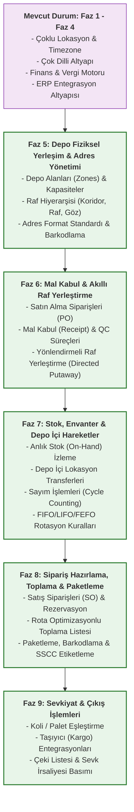

# WMS Temel Operasyonel Modüller Proje Planı (Yol Haritası)

Lokalizasyon, Çoklu Para Birimi, Vergi ve Entegrasyon altyapısını içeren ilk 4 fazı tamamladıktan sonra, projenin **gerçek depo yönetim fonksiyonlarını (Business Logic)** kazanabilmesi için izlemeniz gereken yol haritası aşağıda **5 yeni fazda (Faz 5 - Faz 9)** planlanmıştır.

---

---

## Faz 5: Depo Fiziksel Yerleşim & Adres Yönetimi (Location Management)
* **Kapsam:** Depo içi alanların (Zone), koridor, raf ve göz yapısının kurgulanması.
* **Modül:** `wms-core-service` veritabanına eklenir.
* **Gereksinimler:**
  1. **Alan Tanımları (Zones):** Soğuk Oda, Karantina, Hızlı Tüketim, Standart Depolama vb. alanların tanımlanması.
  2. **Adresleme Yapısı:** `Koridor - Bölüm - Raf - Göz` formatında standart adres kodlaması üretimi (Örn: `A-12-03-01` -> A Koridoru, 12. Bölüm, 3. Kat, 1. Göz).
  3. **Kapasite ve Ağırlık Kuralları:** Her bir depo gözünün (Bin) taşıyabileceği maksimum hacim (m3) ve ağırlık (kg) limitlerinin tanımlanması.

---

## Faz 6: Mal Kabul & Akıllı Raf Yerleştirme (Inbound & Putaway)
* **Kapsam:** Satın alma siparişlerinin depo kapısında karşılanması ve raflara yerleştirilmesi.
* **Modül:** Yeni bir mikroservis olan `wms-inbound-service` (Veritabanı: `wms_inbound_db`) kurulur.
* **Gereksinimler:**
  1. **Satın Alma Siparişleri (PO):** ERP'den gelen satın alma siparişlerinin karşılanması.
  2. **Mal Kabul (Receipt):** Gelen ürünlerin miktar ve kalite kontrollerinin (QC) yapılması.
  3. **Yönlendirmeli Raf Yerleştirme (Directed Putaway):** Ürünün özelliklerine (Örn: Soğuk zincir ise Soğuk Zone'a, hızlı tüketim ise kapıya yakın bir göze) ve göz kapasitesine göre sistemin kullanıcıya otomatik olarak yerleştireceği en uygun raf adresini önermesi.

---

## Faz 7: Stok, Envanter & Depo İçi Hareketler (Inventory & Warehouse Movements)
* **Kapsam:** Depodaki stokların anlık izlenmesi, yerlerinin değiştirilmesi ve sayım işlemleri.
* **Modül:** Yeni bir mikroservis olan `wms-inventory-service` (Veritabanı: `wms_inventory_db`) kurulur.
* **Gereksinimler:**
  1. **Anlık Stok İzleme:** Hangi rafta, hangi üründen, ne kadar, hangi lot/seri numarasıyla bulunduğunun anlık takibi.
  2. **Depo İçi Lokasyon Transferleri:** Ürünlerin depo içinde bir gözden diğer göze taşınması ve stok hareket geçmişi.
  3. **Stok Rotasyon Kuralları (FIFO/LIFO/FEFO):** Son kullanma tarihi en yakın olanın önce çıkmasını (FEFO) garanti edecek stok çıkış sıralama mantığı.
  4. **Periyodik Sayım (Cycle Counting):** Depoda sistem stok verileriyle fiziksel stokların karşılaştırılması ve otomatik stok düzeltmeleri.

---

## Faz 8: Sipariş Hazırlama, Toplama & Paketleme (Outbound, Picking & Packing)
* **Kapsam:** Müşteri siparişlerinin toplanması ve paketlenmesi.
* **Modül:** Yeni bir mikroservis olan `wms-outbound-service` (Veritabanı: `wms_outbound_db`) kurulur.
* **Gereksinimler:**
  1. **Sipariş Karşılama & Rezervasyon:** Gelen sipariş miktarlarını stoktan düşmeden "Rezerve" (Soft-Allocation) durumuna alma.
  2. **Rota Optimizasyonlu Toplama Listesi (Picking Rote):** Toplayıcının depo içinde en az yürümesini sağlayacak şekilde (S-Shape veya Z-Shape rotalarıyla) sıralanmış ürün toplama görevlerinin oluşturulması.
  3. **Paketleme (Packing):** Toplanan ürünlerin kolilere konulması, barkodlanması ve sevkiyat birimi (SSCC/Palet) numaralarının atanması.

---

## Faz 9: Sevkiyat & Çıkış İşlemleri (Shipping & Dispatch)
* **Kapsam:** Hazırlanan siparişlerin araçlara yüklenerek depodan çıkış yapması.
* **Modül:** `wms-outbound-service` veya `wms-integration-service` kapsamındadır.
* **Gereksinimler:**
  1. **Taşıyıcı / Kargo Entegrasyonu:** Yurtiçi/Yurtdışı kargo veya nakliye firmalarıyla entegrasyon kurup otomatik takip numarası ve kargo barkodu alınması.
  2. **Çeki Listesi (Packing List):** Hangi palette/kolide hangi ürünlerin olduğunu gösteren çeki listesi basımı.
  3. **Sevk İrsaliyesi / ERP Güncellemesi:** Çıkışı onaylanan ürünlerin stok bilgisini ERP sistemine göndererek fiili sevkiyatı ERP'de de tamamlamak.

---

## 4. Şimdi Ne Yapacağız? Nasıl İlerlemeliyiz?

Veritabanı altyapınız yerel makinenizde kurulu ve Spring Boot projelerinizin iskeletleri hazır olduğuna göre **Faz 5 (Depo Fiziksel Yerleşim & Adres Yönetimi)** modülünden başlayarak her modül için sırasıyla detaylı LLM promptlarını ve veri modellerini hazırlayabiliriz.

Eğer bu yol haritası sizin için uygunsa:
1. **"Faz 5: Depo Fiziksel Yerleşim ve Adres Yönetimi"** için veri modelleri, ilişkiler ve akıllı kapasite kontrol algoritmalarını içeren teknik tasarımları oluşturarak işe koyulalım mı?
2. Yoksa daha önce hazırladığımız ilk 4 fazın Spring Boot kodlama sürecinde taklığınız veya sormak istediğiniz bir yer oldu mu?
