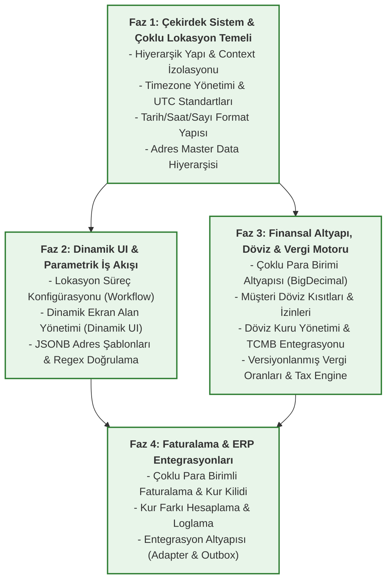

# WMS Çoklu Lokasyon & Lokalizasyon Projesi Uygulama Fazları

Bu proje planı, 15 iş isterini teknik bağımlılık sırasına göre **4 mantıksal faza** bölmektedir. Her fazın başında LLM'e projenin o aşamadaki genel resmini ve mimari hedefini aktarmak için kullanabileceğiniz **Makro Faz Promptları** tanımlanmıştır.

---



---

## Faz 1: Çekirdek Sistem & Çoklu Lokasyon Temeli
* **Kapsam:** İş İsterleri 1, 6, 7, 13.
* **Amaç:** Veritabanının temel hiyerarşik yapısını kurmak, API seviyesinde aktif lokasyon bağlamını (Context) ThreadLocal olarak izole etmek, zamanı UTC olarak kaydedip yerel saat dilimlerinde işlemek, formatları yönetmek ve adres master datalarını hiyerarşik ilişkilendirmek.

### Makro Faz 1 Yönlendirme Promptu
```text
Rolün: Lead Software Architect & Backend Engineer.
Proje Bağlamı: Java 21, Spring Boot 3.x ve PostgreSQL kullanan çoklu firma (multi-tenant) ve çoklu lokasyon (multi-location) destekleyen bir Depo Yönetim Sistemi (WMS) geliştiriyoruz.

Görevimiz: Faz 1 kapsamında sistemin Çekirdek Çoklu Lokasyon ve Lokalizasyon altyapısını kurmak.

Faz 1'de Yapılacak İşler:
1. Organizasyon, Şirket, Ülke, Şehir, Depo, Yetkilendirme (UserAccess) veri modelini tasarlamak.
2. API isteklerinde Header'dan gelen 'X-Active-Location-ID' ve 'X-Active-Company-ID' bilgilerini JWT yetkileriyle doğrulayıp request-scoped (ThreadLocal) Context nesnesinde saklamak.
3. Zaman verilerini TIMESTAMPTZ (UTC) olarak saklayıp API JSON çıktısında ISO 8601 UTC formatına zorlamak. Sunucu taraflı raporlarda lokasyon timezone dönüşüm servisini yazmak.
4. Ülkelere göre tarih-saat maskelerini ve ondalık/binlik sayı ayıraçlarını API üzerinden arayüzle paylaşmak.
5. Hiyerarşik adres master verilerini (Ülke ➔ Eyalet ➔ Şehir ➔ İlçe ➔ Mahalle) kurup bağımlı seçim API'lerini kodlamak.

Bu aşamada senden beklenen: Her alt adımın kodlamasına geçmeden önce, bu mimarinin genel yapılandırma sınıflarını, temel paket yapısını ve bağımlılıklarını belirlemen. Hazır olduğunda alt modüllerin detaylı promptlarını (Prompt 1.1, 1.2, 6.1 vb.) sırasıyla uygulayarak temiz Java kodlarını üreteceğiz.
```

---

## Faz 2: Dinamik UI & Parametrik İş Akışı
* **Kapsam:** İş İsterleri 3, 5, 12.
* **Amaç:** Deponun süreç adımlarının (Mal kabul, QC vb.) sırasını ve zorunluluğunu kod yazmadan dinamik belirlemek, ekranlardaki alanların davranışlarını (zorunlu, gizli vb.) öncelikli kurallarla çözmek ve dinamik JSONB adres alanlarını regex ile doğrulamak.

### Makro Faz 2 Yönlendirme Promptu
```text
Rolün: Lead Software Architect & Rules Engine Expert.
Proje Bağlamı: Java 21, Spring Boot 3.x, Spring Data JPA ve PostgreSQL kullanan WMS projemizde Faz 1 başarıyla tamamlandı. Artık sistem aktif lokasyon ve kullanıcı bilgilerini context'ten okuyabiliyor.

Görevimiz: Faz 2 kapsamında "Dinamik UI ve Parametrik İş Akışları" motorlarını (Rules Engine) inşa etmek.

Faz 2'de Yapılacak İşler:
1. Depo bazında iş akışı adımlarının sırasını (sequence) ve zorunluluğunu parametrik yöneten bir 'Workflow Engine' ve 'Validator' servisleri kurmak.
2. Arayüz formlarının (Örn: Mal Kabul Formu, Müşteri Kartı Formu) alanlarını ve doğrulamalarını, aktif lokasyon/rol/operasyon tipi gibi bağlamlara göre (Priority mantığıyla) dinamik çözümleyip arayüze JSON Şeması olarak dönen 'Dynamic UI Engine' yazmak.
3. API POST/PUT isteklerinde bu dinamik kuralları sunucu tarafında (Server-side validation) Aspect (AOP) ile doğrulayan kısıtları kodlamak.
4. Adres verilerini veritabanında JSONB olarak saklamak ve ülkelere göre dinamik zorunluluk/regex doğrulamalarını bu JSONB alanlar üzerinde uygulamak.

Bu aşamada senden beklenen: Faz 2 kurallar motorunun genel çalışma mimarisini, caching stratejisini (Redis) ve interceptor/AOP yapılandırmasını tasarlamandır. Sonrasında alt promptları çalıştıracağız.
```

---

## Faz 3: Finansal Altyapı, Döviz & Vergi Motoru
* **Kapsam:** İş İsterleri 8, 9, 10, 14, 15.
* **Amaç:** Finansal yuvarlama hatalarını sıfırlamak, müşteri bazlı döviz kısıtlamalarını yönetmek, günlük TCMB kurlarını otomatik çekip manuel kurları audit log ile izlemek ve tarih bazlı vergi oranlarını dinamik vergi motoruyla (Strategy Pattern) hesaplamak.

### Makro Faz 3 Yönlendirme Promptu
```text
Rolün: Lead Financial Software Architect & Tax System Expert.
Proje Bağlamı: Java 21, Spring Boot 3.x, JPA ve PostgreSQL kullanan WMS projemizde hiyerarşik yapı ve kurallar motorları kuruldu.

Görevimiz: Faz 3 kapsamında sistemin "Çoklu Para Birimi, Döviz Kuru ve Vergi Hesaplama Motoru" modüllerini kodlamak.

Faz 3'de Yapılacak İşler:
1. Finansal işlemleri BigDecimal formatında original_amount, exchange_rate ve converted_amount kırılımıyla saklayan veri modelini kurmak.
2. Çevrimlerde Banker's Rounding (HALF_EVEN) uygulamak. Kurlar bulunamadığında geçmiş tarihe fallback (max 5 gün) yapan motoru yazmak.
3. Müşteri kartlarında varsayılan ve izin verilen döviz kısıtlamalarını tanımlayıp sipariş anında API seviyesinde doğrulamak.
4. Her gün 15:35'te TCMB XML servisinden kurları otomatik çeken Scheduled Crawler yazmak. Manuel kur güncellemelerini audit log'a kaydetmek.
5. Vergi oranlarını geçerlilik tarihleriyle versiyonlayıp çakışmaları önlemek. Ülke, Lokasyon, Müşteri ve Ürün bazlı dinamik çözümlenen vergi oranını bulmak.
6. Strategy Pattern kullanarak vergi dahil, hariç ve katmanlı (ÖTV+KDV) vergi hesaplayan ve matrah/hesaplama detaylarını izlenebilirlik (log) tablosuna yazan 'Tax Engine' modülünü geliştirmek.

Bu aşamada senden beklenen: Finansal hesaplamalarda yuvarlama hassasiyet standartlarını ve vergi motorunun tasarım desenini (Strategy Pattern) projemize entegre etmendir.
```

---

## Faz 4: Faturalama & ERP Entegrasyonları
* **Kapsam:** İş İsterleri 4, 11.
* **Amaç:** Fatura başlık ve satırlarını dövizli hesaplamak, onaylandığında kuru dondurmak (rate lock), ödeme anında kur farklarını loglamak ve tüm bu işlemleri gevşek bağlı adaptörler (Adapter Pattern) ve işlemsel kuyruk (Outbox Pattern) ile harici ERP sistemlerine güvenle aktarmak.

### Makro Faz 4 Yönlendirme Promptu
```text
Rolün: Lead Integration Architect & Senior Backend Engineer.
Proje Bağlamı: Java 21, Spring Boot 3.x, JPA ve PostgreSQL kullanan WMS projemizde finansal motor, kurallar katmanı ve çekirdek yapı başarıyla tamamlandı.

Görevimiz: Faz 4 kapsamında "Çoklu Para Birimli Faturalama" süreçlerini tamamlamak ve sistemi harici ERP'lerle entegre edecek güvenli "Integration Framework" yapısını kurmak.

Faz 4'de Yapılacak İşler:
1. Fatura başlık ve satır detaylarını orijinal döviz ve yerel para karşılıklarıyla hesaplayıp kaydeden, onaylanan faturada kur güncellenmesini engelleyen (Rate Lock) faturalama modülünü kodlamak.
2. Fatura tarihi ile ödeme tarihi kurları arasındaki farktan kaynaklanan kur farklarını hesaplayıp loglayan modülü yazmak.
3. Farklı depolar için farklı ERP entegrasyon tiplerini (SAP, Oracle, Logo vb.) Spring context'ten dinamik çözen 'ErpAdapterFactory' ve 'IErpAdapter' arayüzlerini (Adapter Pattern) yazmak.
4. Ağ kesintilerinde veya ERP arızalarında veri kaybı yaşanmaması için işlemleri stok hareketiyle tek transaksiyonda 'Outbox' tablosuna yazan, ardından bir Spring Scheduler yardımıyla kilitli okuma (Pessimistic Lock) ve katlanarak artan yeniden deneme süreleriyle (Exponential Backoff) asenkron gönderen 'Outbox Worker' altyapısını kurmak.
5. Başarısız entegrasyon işlerinin listelenebileceği ve elle zorlayarak yeniden denetilebileceği (Force Retry) API'leri ve 30 günlük log temizleme job'ını yazmak.

Bu aşamada senden beklenen: Entegrasyon altyapısının hata tolerans mimarisini (Outbox & Retry) ve gevşek bağlı adaptör yapısını (Adapter Pattern) kurgulamandır.
```
