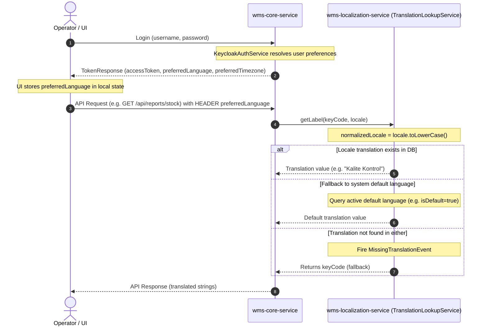

# Translation Lookup & User Language Preference Flow

This document describes the sequence of language resolution and lookup inside `wms-localization-service`'s `TranslationLookupService`.

## Sequence Flow

## Preference Fallback Resolution

At login or token refresh, if the user's `preferredLanguage` is `null`:
1. The backend inspects the user's assigned `UserAccess` records to locate the first non-null `Location`.
2. Resolves the `Country` entity linked to the `Location` via its `Region`.
3. Maps the country's `isoCode` (e.g. `TR`, `US`, `DE`) to the corresponding ISO 639-1 language code (e.g. `tr`, `en`, `de`).
4. If no locations or country ISO codes are found, fallbacks to `en`.
